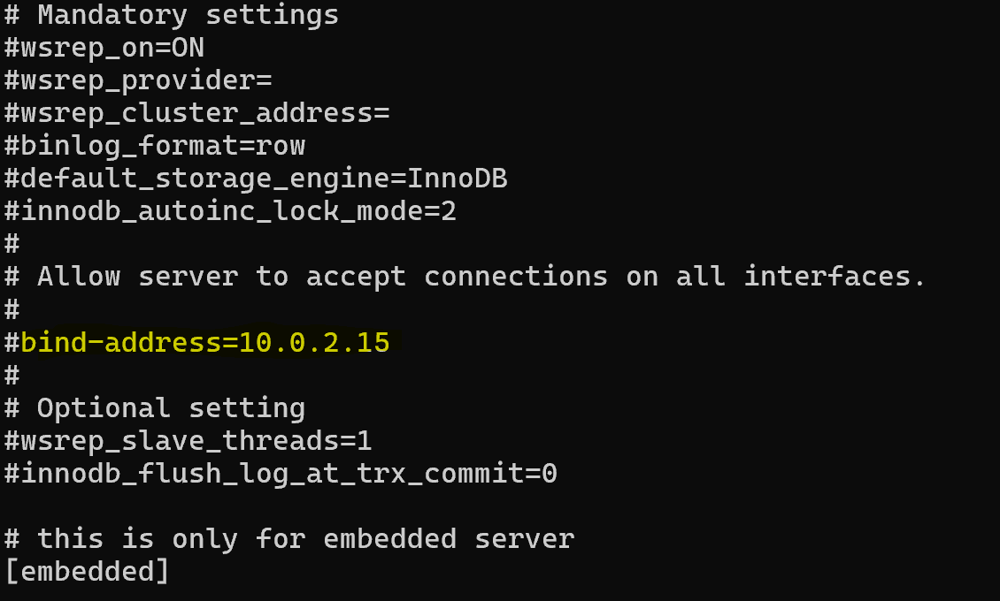

# Testplan

- Auteur(s) testplan: Brent De Clercq, Julie De Witte

## Test: Installatie

Testprocedure:

1. Navigeer naar de map `/opdrachten/Linux/Vagrant/`
2. Voer volgend commando uit: `vagrant up db`
3. ssh naar server: `vagrant ssh db`
4. Check of de service draait: `sudo systemctl status mariadb`
5. `sudo ss -tlnp`

Verwacht resultaat:

- Mariadb is aan het draaien en is enabled

<!-- Voeg hier eventueel een screenshot van het verwachte resultaat in. -->

## Test: Firewall

Testprocedure:

1. Navigeer naar de map `/opdrachten/Linux/Vagrant/`
2. Voer volgend commando uit: `vagrant up db`
3. ssh naar server: `vagrant ssh db`
4. Controleer de openstaande poorten bij de firewall-service. Ga na dat dit enkel poort 22 & 3306 is: `sudo firewall-cmd --list-all`

Verwacht resultaat:

- Enkel poort 22 & poort 3306 zijn bereikbaar.

## Test: Configuratie

Testprocedure:

1. Navigeer naar de map `/opdrachten/Linux/Vagrant/`
2. Voer volgend commando uit: `vagrant up db`
3. ssh naar server: `vagrant ssh db`
4. Ga na of het bind-address het IP-adres is van de webserver (10.0.2.15): `cat /etc/my.cnf.d/mariadb-server.cnf`
5. Scroll in deze file naar de regel waar 'bind-address' zich bevindt, en ga na dat deze wel degelijk 10.0.2.15 is.

Verwacht resultaat:

- Het bind-address is correct ingesteld op het IP-adres van de webserver

<!-- Voeg hier eventueel een screenshot van het verwachte resultaat in. -->

<!-- Voeg hier eventueel een screenshot van het verwachte resultaat in. -->

## Test: User en database aanmaken

Testprocedure:

1. In het vars bestand, pas de netwerk instellingen tijdelijk aan zodat dit thuis ook werkt (bij de meesten zal een ip in de range 192.168.0.0/24 goed zijn)
2. Navigeer naar de map `/opdrachten/Linux/Vagrant/`
3. Voer volgend commando uit: `vagrant up db`
4. ssh naar server: `vagrant ssh db`
5. Er zou een gebruiker moeten zijn met naam 'tenurit', login met volgend commando `mysql -u tenurit -p` (zie vars voor wachtwoord)
6. Test of de database beschikbaar is: `USE wp;`

## Test: Root-login

Testprocedure:

1. Navigeer naar de map `/opdrachten/Linux/Vagrant/`
2. Voer volgend commando uit: `vagrant up database`
3. Ssh naar server: `vagrant ssh database`
4. Probeer in te loggen als root in de database met volgend commando: `mysql -u root -p`

Verwacht resultaat:

- De access wordt denied voor de root user.

<!-- Voeg hier eventueel een screenshot van het verwachte resultaat in. -->
