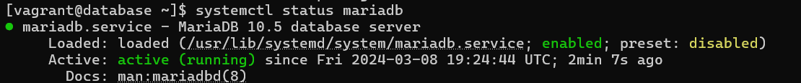
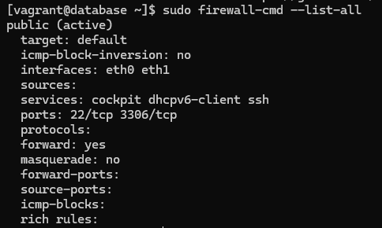
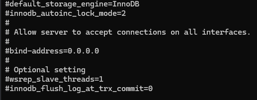

# Testrapport

- Uitvoerder(s) test: Kenji De Coster
- Uitgevoerd op: 8/3/2024
- Github commit: <!-- Git commit hash. -->

## Test: Installatie

Testprocedure:

1. Navigeer naar de map `/opdrachten/Linux/Vagrant/`
2. Voer volgend commando uit: `vagrant up database`
3. ssh naar server: `vagrant ssh database`
4. Check of de service draait: `sudo systemctl status mariadb`
5. `sudo ss -tlnp`

Verkregen resultaat:

- Mariadb is aan het draaien en is enabled

<!-- Voeg hier eventueel een screenshot van het verkregen resultaat in. -->

Test geslaagd:

- [x] Ja
- [ ] Nee

Opmerkingen:

- ...

## Test: Firewall

Testprocedure:

1. Navigeer naar de map `/opdrachten/Linux/Vagrant/`
2. Voer volgend commando uit: `vagrant up database`
3. ssh naar server: `vagrant ssh database`
4. Controleer de openstaande poorten bij de firewall-service. Ga na dat dit enkel poort 22 & 3306 is: `sudo firewall-cmd --list-all`

Verkregen resultaat:

- Enkel poort 22 & poort 3306 zijn bereikbaar

<!-- Voeg hier eventueel een screenshot van het verkregen resultaat in. -->

Test geslaagd:

- [x] Ja
- [ ] Nee

Opmerkingen:

- ...

## Test: Configuratie

Testprocedure:

1. Navigeer naar de map `/opdrachten/Linux/Vagrant/`
2. Voer volgend commando uit: `vagrant up db`
3. ssh naar server: `vagrant ssh db`
4. Ga na of het bind-address het IP-adres is van de webserver (10.0.2.15): `cat /etc/my.cnf.d/mariadb-server.cnf`
5. Scroll in deze file naar de regel waar 'bind-address' zich bevindt, en ga na dat deze wel degelijk 10.0.2.15 is.

Verkregen resultaat:

- Bind adress is niet ingesteld

<!-- Voeg hier eventueel een screenshot van het verkregen resultaat in. -->

Test geslaagd:

- [ ] Ja
- [x] Nee

Opmerkingen:

- Er is een probleem met het sed commando denk ik
