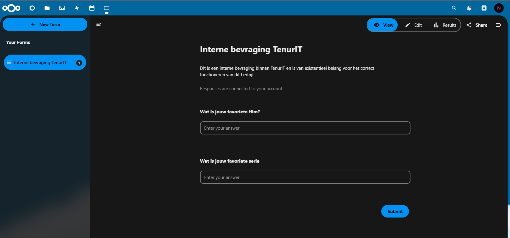

# Testplan

- Auteur(s) testplan: Brent De Clercq

## Test: Installatie

Testprocedure:

1. Start de database en nextcloud vm's: `vagrant up db nextcloud`
2. Surf naar 192.168.106.245/nextcloud

Verwacht resultaat:

- De login pagina van Nextcloud is zichtbaar

<!-- Voeg hier eventueel een screenshot van het verwachte resultaat in. -->

## Test: Accounts

Testprocedure:

1. Login als admin:

   - Username: `next`
   - Password: `cloud`

2. Login als extra gebruiker:

   - Username: `Brent`
   - Password: `Brent.2024`

Verwacht resultaat:

- Je kan op beide accounts inloggen

<!-- Voeg hier eventueel een screenshot van het verwachte resultaat in. -->

## Test: Kalender

Testprocedure:

1. Login op het account `next` met wachtwoord `cloud`
2. Klik vanboven op het kalender icoontje

Verwacht resultaat:

- De kalender is zichtbaar
- Er is een "afspraak" op 16 mei gepland

<!-- Voeg hier eventueel een screenshot van het verwachte resultaat in. -->

## Test: Forms

Testprocedure:

1. Login op nextcloud
2. Klik op het forms icoontje

Verwacht resultaat:

- Er is een form zichtbaar, als je ingelogd bent via `next`, kan je dit ook bewerken

<!-- Voeg hier eventueel een screenshot van het verwachte resultaat in. -->

## Test: <!-- Omschrijving test. -->

Testprocedure:

1. ...
2. ...

Verwacht resultaat:

- ...
- ...

<!-- Voeg hier eventueel een screenshot van het verwachte resultaat in. -->
