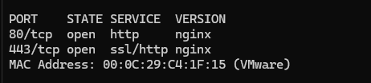

# Testrapport

- Uitvoerder(s) test: Brent De Clercq
- Uitgevoerd op: 22/03/2024
- Github commit: 0b10a34

## Test: Installatie

Test procedure:

1. Navigeer naar de map `/opdrachten/Linux/Vagrant/`
2. Voer volgend commando uit: `vagrant up proxy`
3. ssh naar server: `vagrant ssh proxy`
4. Check of de service draait: `sudo systemctl status nginx`

Verkregen resultaat:

- De nginx service is aan het runnen en is enabled

Test geslaagd:

- [x] Ja
- [ ] Nee

Opmerkingen:

- ...

## Test: Nmap obfuscation

Test procedure:

1. voer volgend commandos uit ergens, behalve op de proxy:
   1. `nmap 192.168.106.250`
   2. `nmap -p80,443 192.168.106.250`
   3. `nmap -sV -p80,443 192.168.106.250`

Verkregen resultaat:

- Nmap versie is niet zichtbaar
- Custom header werkt niet

<!-- Voeg hier eventueel een screenshot van het verkregen resultaat in. -->

Test geslaagd:

- [ ] Ja
- [x] Half
- [ ] Nee

Opmerkingen:

- ...

## Test: <!-- Omschrijving test. -->

...
