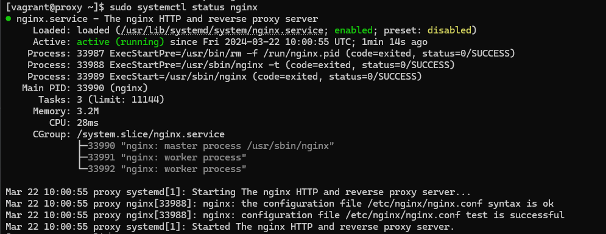

# Testrapport

- Uitvoerder(s) test: Brent De Clercq
- Uitgevoerd op: 22/03/2024
- Github commit: 0b10a34

## Test: Installatie

Test procedure:

1. Navigeer naar de map `/opdrachten/Linux/Vagrant/`
2. Voer volgend commando uit: `vagrant up proxy`
3. ssh naar server: `vagrant ssh proxy`
4. Check of de service draait: `sudo systemctl status nginx`

Verkregen resultaat:

- De nginx service is aan het runnen en is enabled

Test geslaagd:

- [x] Ja
- [ ] Nee

Opmerkingen:

- ...

## Test: <!-- Omschrijving test. -->

Test procedure:

1. ...
2. ...

Verkregen resultaat:

- ...
- ...

<!-- Voeg hier eventueel een screenshot van het verkregen resultaat in. -->

Test geslaagd:

- [ ] Ja
- [ ] Nee

Opmerkingen:

- ...

## Test: <!-- Omschrijving test. -->

...
