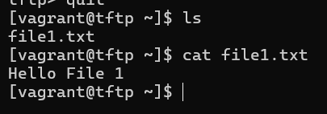

# Testrapport

- Uitvoerder(s) test: Kenji De Coster
- Uitgevoerd op: 8/3/2024
- Github commit: <!-- Git commit hash. -->

## Test: Vagrant Up, TFTP server moet lokaal draaien

Testprocedure:

1. Navigeer naar de map `/opdrachten/Linux/Vagrant/`
2. Voer volgend commando uit: `vagrant up tftp`
3. ssh naar server: `vagrant ssh tftp`
4. Er worden een aantal testbestanden automatisch toegevoegd aan de TFTP server: `file1.txt`, `file2.txt` en `file3.txt`
5. Haal deze bestanden op van de tftp server via volgende commando's:
6. `tftp localhost`
7. `get file1.txt`
8. `quit`

Verkregen resultaat:

- Dit werkt direct zonder `Request Timed Out`
- Er staat nu een bestand file1.txt in de map waar je het commando `tftp localhost` hebt uitgevoerd, dit bestand bevat de tekst `Hello File 1`

<!-- Voeg hier eventueel een screenshot van het verkregen resultaat in.-->

Test geslaagd:

- [x] Ja
- [ ] Nee

Opmerkingen:

- ...

## Test: <!-- Omschrijving test. -->

Test procedure:

1. ...
2. ...

Verkregen resultaat:

- ...
- ...

<!-- Voeg hier eventueel een screenshot van het verkregen resultaat in. -->

Test geslaagd:

- [ ] Ja
- [ ] Nee

Opmerkingen:

- ...

## Test: <!-- Omschrijving test. -->

...
