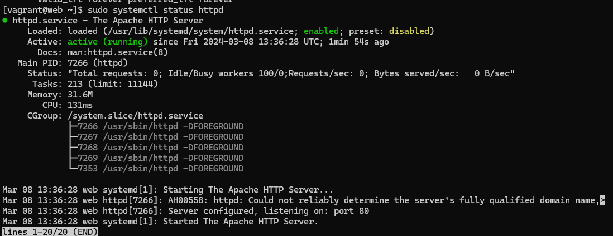
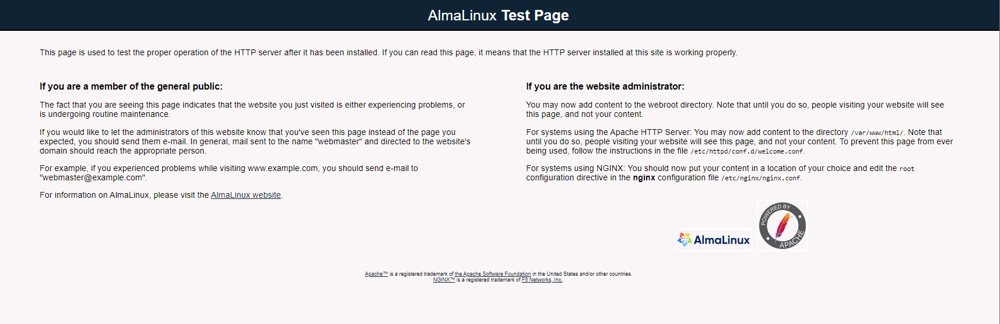
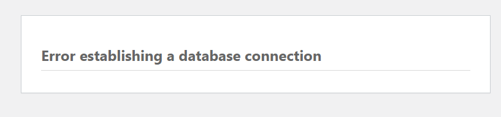
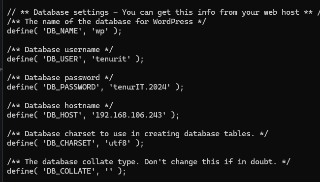
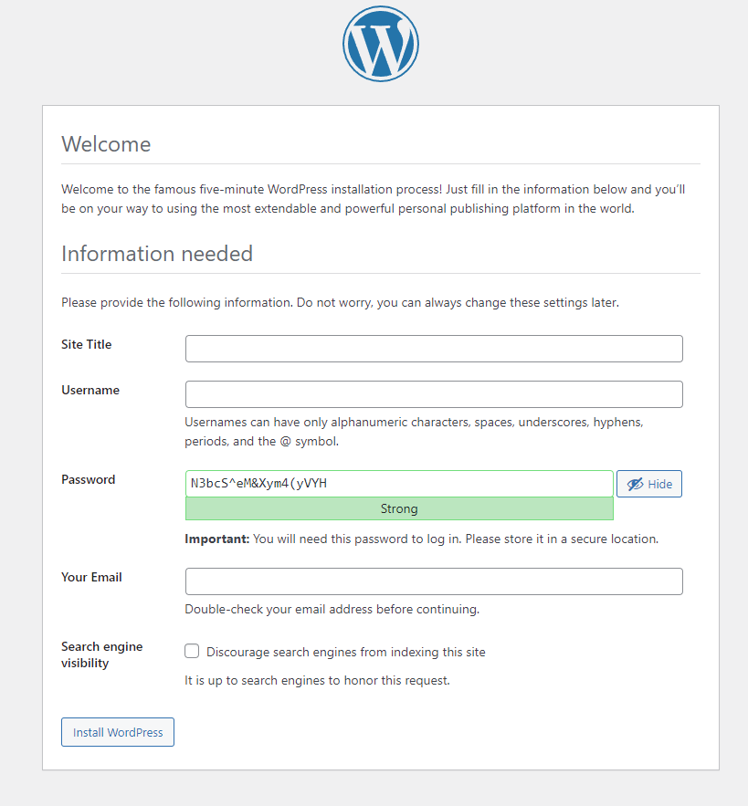

# Testplan

- Auteur(s) testplan: Brent

## Test: Installatie httpd

Testprocedure:

1. Navigeer naar de map `/opdrachten/Linux/Vagrant/`
2. Voer volgend commando uit: `vagrant up web`
3. ssh naar server: `vagrant ssh web`
4. Check of de service draait: `sudo systemctl status httpd`
5. `sudo ss -tlnp`
6. surf naar het NAT-ip address met poort 80

Verwacht resultaat:

- http is enabled en draait op poort 80
- De voorbeeld site is zichtbaar in de browser

<!-- Voeg hier eventueel een screenshot van het verwachte resultaat in. -->

## Test: CMS

Testprocedure:

1. Navigeer naar de map `/opdrachten/Linux/Vagrant/`
2. Voer volgend commando uit: `vagrant up web`
3. ssh naar server: `vagrant ssh web`
4. Indien je virtualbox gebruikt: open poort 80 op nat interface
5. Surf naar het ip address van de NAT int; vb: 10.0.2.15

Verwacht resultaat:

- De wordpress site is deels zichtbaar, maar geeft nog een database error omdat de database nog niet geconfigureerd is
- De configuratie moet wel al juist ingevuld zijn, bekijken via `cat /var/www/html/wordpress/wp-config.php`

<!-- Voeg hier eventueel een screenshot van het verwachte resultaat in. -->

## Test: Login en post maken

Testprocedure:

1. Navigeer naar de map `/opdrachten/Linux/Vagrant/`
2. Voer volgend commando uit: `vagrant up web`
3. ssh naar server: `vagrant ssh web db`
4. surf naar het ip address
5. je zal onderstaand scherm zien, hier moet je zelf nog dingen invullen
6. nu kan je inloggen en een post aanmaken

