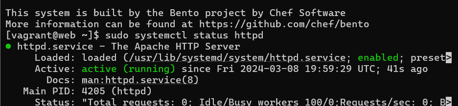
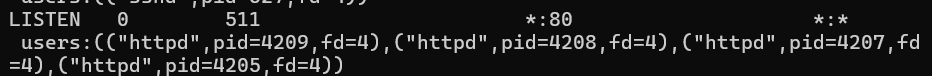
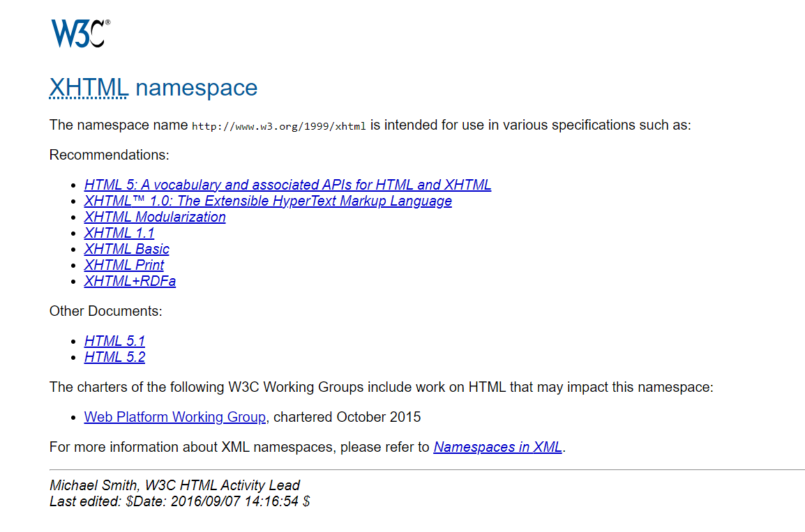

# Testrapport

- Uitvoerder(s) test: Kenji De Coster
- Uitgevoerd op: 8/3/2024
- Github commit: <!-- Git commit hash. -->

## Test: Installatie httpd

Testprocedure:

1. Navigeer naar de map `/opdrachten/Linux/Vagrant/`
2. Voer volgend commando uit: `vagrant up web`
3. ssh naar server: `vagrant ssh web`
4. Check of de service draait: `sudo systemctl status httpd`
5. `sudo ss -tlnp`
6. surf naar het NAT-ip address met poort 80

Verkregen resultaat:

- http is enabled en draait op poort 80
- De voorbeeld site is zichtbaar in de browser

<!-- Voeg hier eventueel een screenshot van het verkregen resultaat in. -->

Test geslaagd:

- [ ] Ja
- [x] Nee

Opmerkingen:

- de website is bereikbaar via de terminal gebruik makend van het nat ip adres en curl. Ook is deze bereikbaar gebruikmakend van de url ,die je krijgt a.d.h.v. curl, in een browser. De website is daarentegen niet bereikbaar wanneer je gewoon het nat ip en het poortnummer ingeeft -> 10.0.2.15:80

## Test: <!-- Omschrijving test. -->

Test procedure:

1. ...
2. ...

Verkregen resultaat:

- ...
- ...

<!-- Voeg hier eventueel een screenshot van het verkregen resultaat in. -->

Test geslaagd:

- [ ] Ja
- [ ] Nee

Opmerkingen:

- ...

## Test: <!-- Omschrijving test. -->

...
