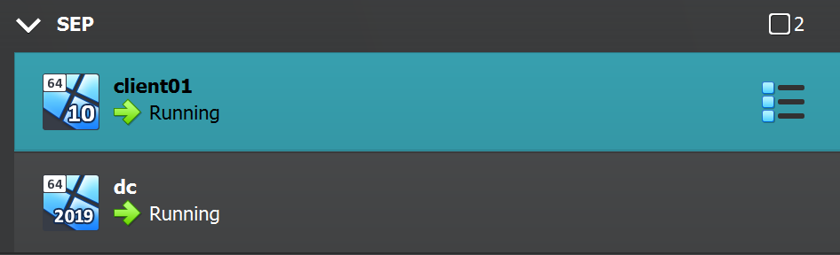
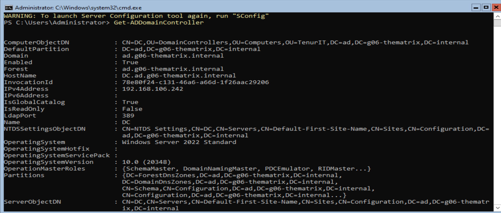

# Testplan

- Auteur(s) testplan: Julie De Witte

## Test: Installatie beide Windows virtuele machines

Testprocedure:

1. Pas alvorens de scripts uit te voeren, de instellingen op je pc aan zodanig dat je VBoxManage scripts kunt uitvoeren
2. Benodigde ISO files: `Windows 10` (clientVM) en `Windows Server` (DomeinController)
3. Voer `server-vm.ps1` uit om de server VM te installeren, en `client-vm.ps` om de client VM te installeren, doe dit aan de hand van shared folders via VirtualBox

Verwacht resultaat:

- Beide draaien correct en kunnen opgestart worden aan de hand van de geautomatiseerde scripts

<!-- Voeg hier eventueel een screenshot van het verwachte resultaat in. -->

## Test: Promoveren van server VM naar domeincontroller

Testprocedure:

1. Voer het script `promoting-dc.ps1` uit op de server VM om deze te promoveren naar DomeinController
2. Zorg wel dat de guest-additions geïnstalleerd zijn, anders zal het script niet werken!
3. Je kan nagaan of het geslaagd is door volgend commando in te geven op de DC: `Get-ADDomainController`

Verwacht resultaat:

- De DomeinController werd succesvol aangemaakt

<!-- Voeg hier eventueel een screenshot van het verwachte resultaat in. -->

## Test: Installeren RSAT tools

Testprocedure:

1. Voer het script `config-client.ps1` uit op de client VM
2. Zorg hier wederom dat de guest-additions geïnstalleerd zijn, aangezien het script anders niet zal werken!
3. Ga na of de RSAT-tools geïnstalleerd zijn via Control Panel

Verwacht resultaat:

- Je beschikt over de benodigde RSAT-tools op je client VM

<!-- Voeg hier eventueel een screenshot van het verwachte resultaat in. -->

