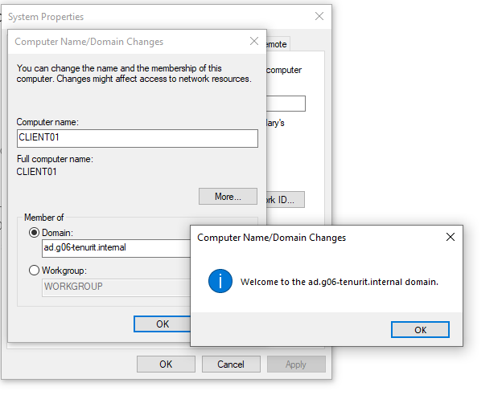

# Testplan

- Auteur(s) testplan: Julie De Witte

## Test: Installatie beide Windows virtuele machines

Testprocedure:

1. Pas alvorens de scripts uit te voeren, de instellingen op je pc aan zodanig dat je VBoxManage scripts kunt uitvoeren
2. Benodigde ISO files: `Windows 10` (clientVM) en `Windows Server` (DomeinController)
3. Voer `server-vm.ps1` uit om de server VM te installeren, en `client-vm.ps` om de client VM te installeren, doe dit aan de hand van shared folders via VirtualBox

Verwacht resultaat:

- Beide draaien correct en kunnen opgestart worden aan de hand van de geautomatiseerde scripts

<!-- Voeg hier eventueel een screenshot van het verwachte resultaat in. -->

## Test: Promoveren van server VM naar domeincontroller

Testprocedure:

1. Voer het script `config-dc1.ps1` uit op de server VM om de instellingen juist te configureren
2. Installeer vervolgens de guest-additions op de server VM
3. Voer het script `install-forest.ps1` uit op de server VM 
4. Je kan nagaan of het geslaagd is door volgend commando in te geven op de DC: `Get-ADDomainController`

Verwacht resultaat:

- De DomeinController werd succesvol aangemaakt

<!-- Voeg hier eventueel een screenshot van het verwachte resultaat in. -->

## Test: Installeren RSAT tools

Testprocedure:

1. Voer het script `config-client01.ps1` uit op de client VM
2. Voer het script `rsat.ps1` uit op de client VM (internet connectie is hiervoor noodzakelijk!) 
3. Zorg hier wederom dat de guest-additions geïnstalleerd zijn
4. Ga na of de RSAT-tools geïnstalleerd zijn via Control Panel

Verwacht resultaat:

- Je beschikt over de benodigde RSAT-tools op je client VM

<!-- Voeg hier eventueel een screenshot van het verwachte resultaat in. -->

## Test: Opzetten AD-domein en toevoegen windows client aan dit domein

Testprocedure:

1. Voeg de client toe aan het domein (screenshot voor verdere uitleg)
2. Ga na of de DC en client elkaar kunnen pingen

Verwacht resultaat:

- Via de RSAT tools op de client kun je nagaan of de client daadwerkelijk in het domein zit

<!-- Voeg hier eventueel een screenshot van het verwachte resultaat in. -->

## Test: Opstellen logische domeinstructuur

Testprocedure:

1. Voeg op de DC het script `config-ad.ps1` uit om de logische domeinstructuur op te stellen

Verwacht resultaat:

- De logische domeinstructuur werd opgesteld, dit kun je nagaan via de RSAT-tools
- Er zijn zowel normale users als admins aangemaakt tijdens het proces

<!-- Voeg hier eventueel een screenshot van het verwachte resultaat in. -->

## Test: Instellen group policies & Shared Folders

Testprocedure:

1. Zorg dat niet-admin gebruikers niet kunnen inloggen als admin, door middel van de GPO in te stellen (kijk screenshot)
2. Voer script `shared-folders.ps1` uit 

Verwacht resultaat:

- GPO instellen

- Niet-admin gebruikers zullen niet kunnen inloggen op de DC, admins wel zoals je kan zien op de screenshots

- Gebruikers kunnen elkaars shared folders niet modifiëren, enkel hun eigen shared folders

## Test: Instellen DNS-server

Testprocedure:

Verwacht resultaat:

