# Testrapport
Uitvoerder(s) test: Rayane Yousti
Uitgevoerd op: 29/04/2024

## Test: Installatie beide Windows virtuele machines

Testprocedure:

1. Pas alvorens de scripts uit te voeren, de instellingen op je pc aan zodanig dat je VBoxManage scripts kunt uitvoeren
2. Benodigde ISO files: `Windows 10` (clientVM) en `Windows Server` (DomeinController)
3. Voer `server-vm.ps1` uit om de server VM te installeren, en `client-vm.ps` om de client VM te installeren, doe dit aan de hand van shared folders via VirtualBox

Verkregen resultaat:

Beide VM's zijn correct geïnstalleerd en draaien.

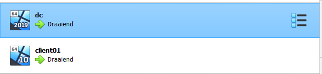

Test geslaagd:

[x] Ja
[ ] Nee

Opmerkingen:

Je zult bij het script bij de laatste lijn de path van je script voor de ISO file moeten aanpassen naar waar jouw ISO file gelocate is.

## Test: Promoveren van server VM naar domeincontroller

Testprocedure:

1. Voer het script `config-dc1.ps1` uit op de server VM om de instellingen juist te configureren
2. Installeer vervolgens de guest-additions op de server VM
3. Voer het script `install-forest.ps1` uit op de server VM 
4. Je kan nagaan of het geslaagd is door volgend commando in te geven op de DC: `Get-ADDomainController`

Verkregen resultaat:

- De DomeinController werd succesvol aangemaakt en is zichtbaar op het netwerk

<!-- Voeg hier eventueel een screenshot van het verwachte resultaat in. -->
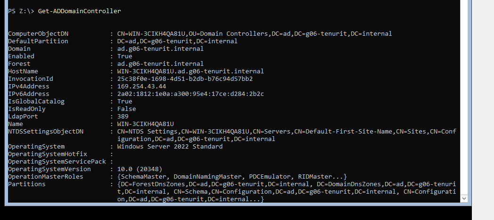

Test geslaagd:

[x] Ja
[ ] Nee

## Test: Installeren RSAT tools

Testprocedure:

1. Voer het script `config-client01.ps1` uit op de client VM
2. Voer het script `rsat.ps1` uit op de client VM (internet connectie is hiervoor noodzakelijk!) 
2. Zorg hier wederom dat de guest-additions geïnstalleerd zijn
3. Ga na of de RSAT-tools geïnstalleerd zijn via Control Panel

Verkregen resultaat:

- De RSAT-tools zijn zichtbaar op je Client.

<!-- Voeg hier eventueel een screenshot van het verwachte resultaat in. -->
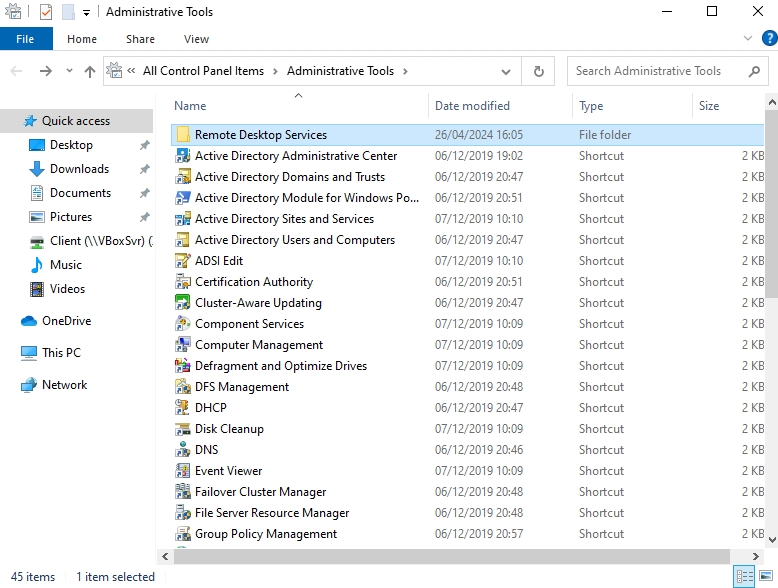

Test geslaagd:

[x] Ja
[ ] Nee

Opmerkingen:

Je zult van de RSAT-tools (Server Manager) pas gebruik kunnen maken eens dat de client in het domein zit.

## Test: Opzetten AD-domein en toevoegen windows client aan dit domein

Testprocedure:

1. Voeg de client toe aan het domein (screenshot voor verdere uitleg)
2. Ga na of de DC en client elkaar kunnen pingen

Verkregen resultaat:

- Je cliënt heeft zich effectief aan het domein aangesloten en je hebt een overzicht van je adapterinstellingen

<!-- Voeg hier eventueel een screenshot van het verwachte resultaat in. -->
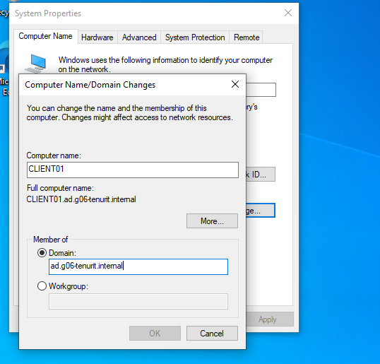
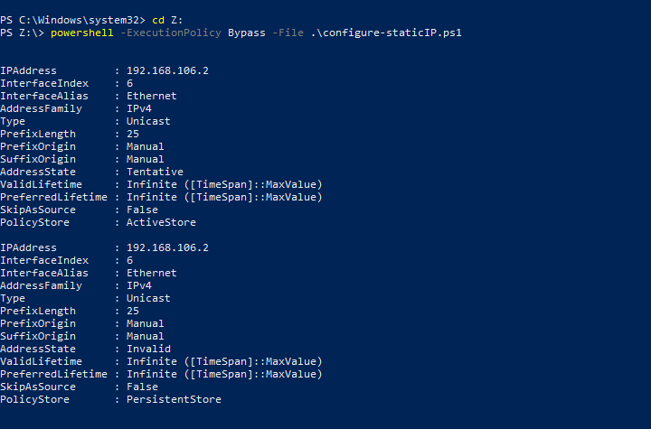

Test geslaagd:

[x] Ja
[ ] Nee

Opmerkingen:

Als je dit van thuis doet, zal je tijdelijk je netwerk van de cliënt in hetzelfde subnet moeten zetten als dat van je server. Aangezien er geen router is die de communicatie verbind van de ene dg naar de andere dg.

## Test: Opstellen logische domeinstructuur

Testprocedure:

1. Voeg op de DC het script `config-ad.ps1` uit om de logische domeinstructuur op te stellen

Verkregen resultaat:

- De logische domeinstructuur werd opgesteld, op de Server Manager kun je dit zien via Active Directory Users and Computers
- Er zijn zowel normale users als admins aangemaakt tijdens het proces

<!-- Voeg hier eventueel een screenshot van het verwachte resultaat in. -->
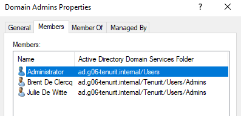
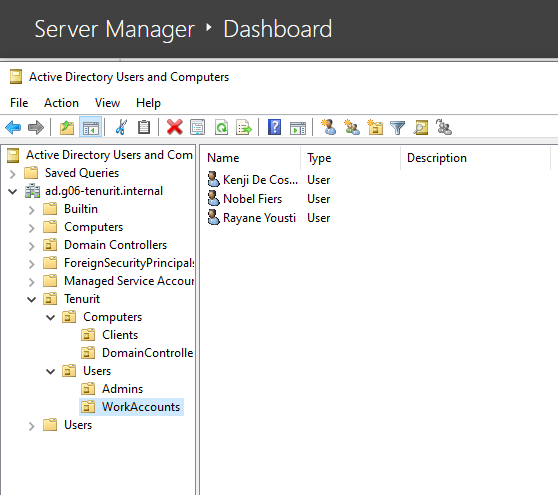
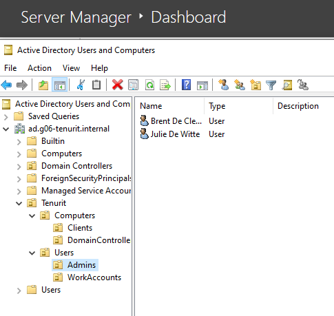

Test geslaagd:

[x] Ja
[ ] Nee

## Test: Instellen group policies & Shared Folders

Testprocedure:

1. Zorg dat niet-admin gebruikers niet kunnen inloggen als admin, door middel van de GPO in te stellen (kijk screenshot)
2. Voer script `shared-folders.ps1` uit 

Verkregen resultaat:

- GPO instellen

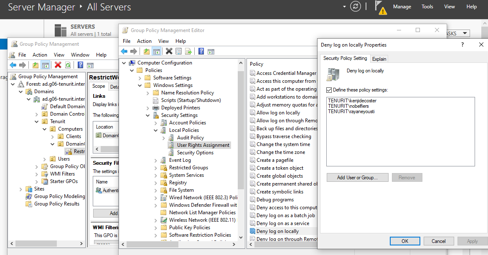

- Niet-admin gebruikers zullen niet kunnen inloggen op de DC, admins wel zoals je kan zien op de screenshots

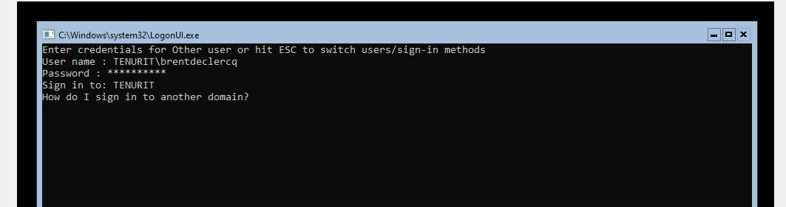
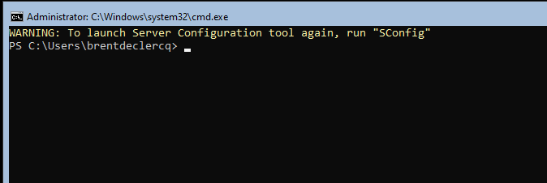

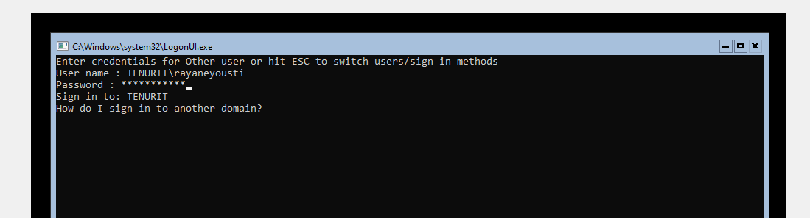
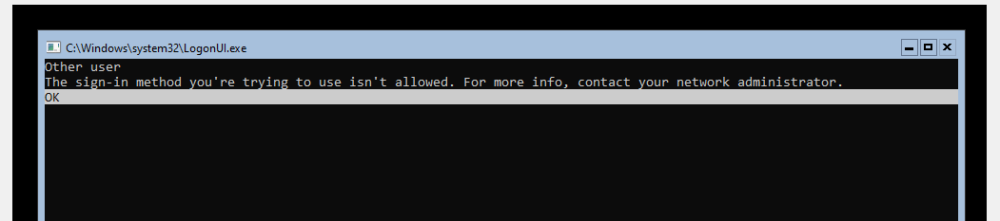

- Gebruikers kunnen elkaars shared folders niet modifiëren, enkel hun eigen shared folders

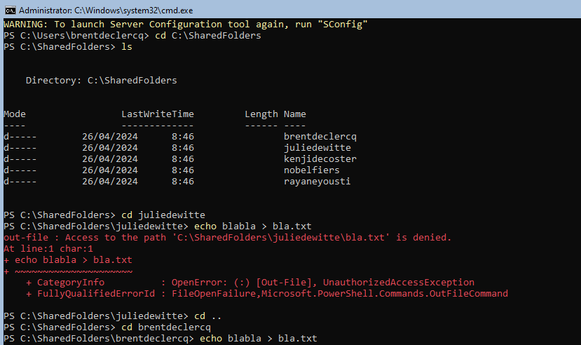
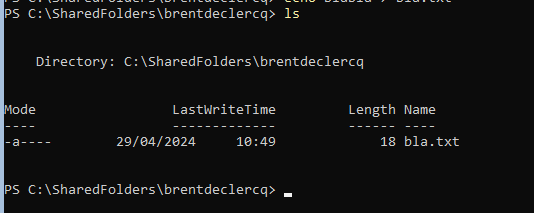

Test geslaagd:

[x] Ja
[ ] Nee

## Test: Instellen DNS-server

Testprocedure:

Verkregen resultaat:

Test geslaagd:

[ ] Ja
[ ] Nee