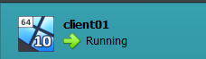
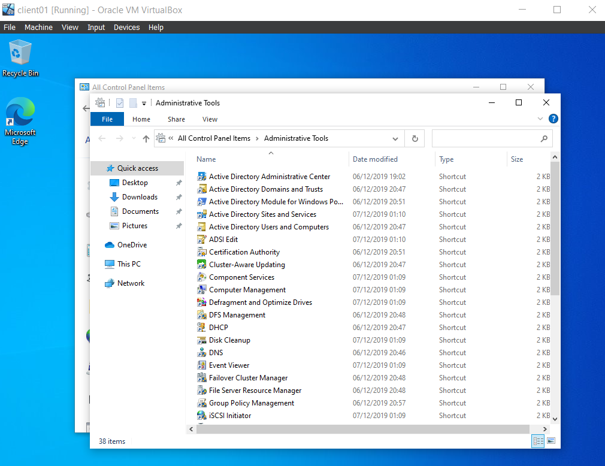

# Testrapport

- Uitvoerder(s) test: Nobel Fiers
- Uitgevoerd op: 26/04/2024

## Test: Installatie Client Windows virtuele machine

Testprocedure:

1. Pas alvorens de scripts uit te voeren, de instellingen op je pc aan zodanig dat je VBoxManage scripts kunt uitvoeren
2. Benodigde ISO files: Windows 10 (clientVM)
3. Voer client-vm.ps om de client VM te installeren, doe dit aan de hand van shared folders via VirtualBox

Verkregen resultaat:

- De vm installeerd en kan opgestart worden.

Test geslaagd:

- [x] Ja
- [ ] Nee

Opmerkingen:

- Script moet aangepast worden per verschillende gebruiker doordat ISO niet bij iedereen in zelfde pad zit.

## Test: Installeren RSAT tools

Testprocedure:

1. Voer het script config-client.ps1 uit op de client VM
2. Zorg hier wederom dat de guest-additions geïnstalleerd zijn, aangezien het script anders niet zal werken!
3. Ga na of de RSAT-tools geïnstalleerd zijn via Control Panel

Verkregen resultaat:

- RSAT tools zijn geinstalleerd

  

<!-- Voeg hier eventueel een screenshot van het verkregen resultaat in. -->

Test geslaagd:

- [x] Ja
- [ ] Nee
