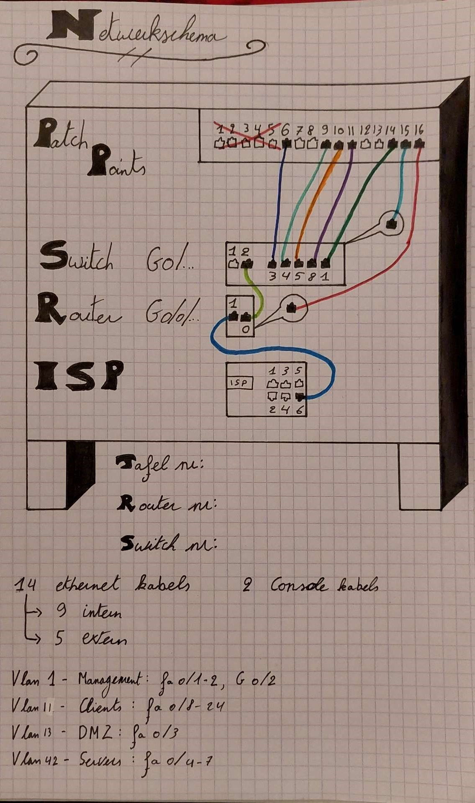

# Testplan voor demo in week 7

## Opzetten

Netwerkschema:

### Algemeen

- [ ] Kabels in serverruimte (15 min)
- [ ] Firewall uitzetten
- [ ] Wifi uitzetten

### Nobel

1. TFTP opstarten
   1. `vagrant up tftp`
2. Kijken of TFTP bridged op de juiste interface van laptop zit
   1. Open Virtualbox
   2. Open VM settings
   3. Controleer of bridged op de juiste adaptor staat: 'REALTEK ...'
3. Router instellen
   1. activeer de router via `enable` en dan `config t`
   2. navigeer naar de interface via `interface g0/0/0`
   3. stel ip address in: `ip-address 192.168.106.233 255.255.255.248`
   4. keer terug naar config t via `exit` en shcrijf `ip tftp source-interface gig0/0/0`
   5. keer terug naar router# via `exit`en vraag de tftp server voor de config via `copy tftp running-config`
   6. nodige gegevens:
      address remote host: `192.168.106.234`
      source filename: `R1_running-config.txt`
      destination filename: `running-config`
   7. Controleer via `do show running-config`
4. Switch instellen
   1. activeer de switch via `enable` en dan `config t`
   2. vlans leegmaken: `delete flash:vlan.dat`
   3. reload switch: `reload`
   4. navigeer naar de interface via `interface vlan 1`
   5. stel ip address in: `ip-address 192.168.106.235 255.255.255.248`
   6. keer terug naar switch# via `exit`en vraag de tftp server voor de config via `copy tftp running-config`
   7. nodige gegevens:
      address remote host: `192.168.106.234`
      source filename: `S1_running-config.txt`
      destination filename: `running-config`
5. Ping testen
   1. Ping van router naar ISP: `do ping 192.168.106.254`
   2. Ping van router naar internet: `do ping 1.1.1.1` of `do ping 8.8.8.8`
   3. ROAS wordt later getest

### Brent

Overzicht van alle taken die iedereen uitvoert, en helpen waar nodig

1. DB en web opstarten
   1. `vagrant up db web`
2. Web inloggen
   1. Normaal via de WinClient, maar kan tijdelijk via NAT-interface als WinClient niet werkt
3. Web post aanmaken

### Kenji

1. Proxy opstarten
   1. `vagrant up proxy`

### Julie

- [ ] Windows server opstarten
- [ ] Check of AD werkt
- [ ] DNS
- [ ] Shared Folder
- [ ] Group Policies controleren

### Rayane

- [ ] Windows Client opstarten
- [ ] In windows client inloggen op server via ad
- [ ] Kijken of RSAT-tools geïnstalleerd zijn

## Belangrijke commando's

- `sudo cat /var/log/httpd/wordpress_access.log`
- `sudo cat /var/log/nginx/access.log`
- `sestatus`

## Tests

### Algemeen (Linux en WinServ)

1. Test voor elke vm of de ip-adressen goed zijn ingesteld: `ip a`/`ipconfig /all`
2. Op elke vm pingen naar de default gateway van die VLAN
3. Vervolgens een andere vm proberen pingen om te zien of ROAS/Inter VLAN routing werkt
4. Ping de router interface aan de kant van de ISP: `ping 192.168.106.253`
5. Ping de ISP: `ping 192.168.106.254`
6. Ping het internet: `ping 8.8.8.8 of ping 1.1.1.1`

### Windows Client

1. Log in op AD
   1. Indien dit faalt, test of de client zeker toegang heeft tot de server
   2. eventueel inloggen op lokale gebruiker en pingen naar de server
2. Probeer te surfen naar de site: `http://www.g06-tenurit.internal en http://g06-tenurit.internal`
3. Hierdoor wordt proxy en dns getest, probeer ook: `https://www.g06-tenurit.internal en https://g06-tenurit.internal`
4. Bij problemen:
   1. Check of DNS aan staat: `nslookup google.com of hogent.be`
   2. Check of DNS naar onze site werkt: `nslookup g06-tenurit.internal`
   3. Check of proxy bereikbaar is: `ping 192.168.106.250`

## Post aanmaken 

`http://g06-tenurit.internal/wp-admin`
- username: tenurit
- password: RJ5@kbIL60Hv@1Je9v