# Opvolgingsrapport 5

## Algemeen

- Groep: G06
- Periode: 14/03/2024 tot 20/03/2024
- Datum voortgangsgesprek: 21/03/2024

| Student         | Afw. | Opmerking |
| :-------------- | :--: | :-------- |
| Brent De Clercq |      |           |
| Kenji De Coster |      |           |
| Nobel Fiers     |      |           |
| Julie De Witte  |      |           |
| Rayane Yousti   |      |           |

## Wat heb je deze periode gerealiseerd?

### Algemeen

- ...
- ...

#### KanBan

<!-- Voeg hier een screenshot toe van de huidige toestand van het kanban bord. -->

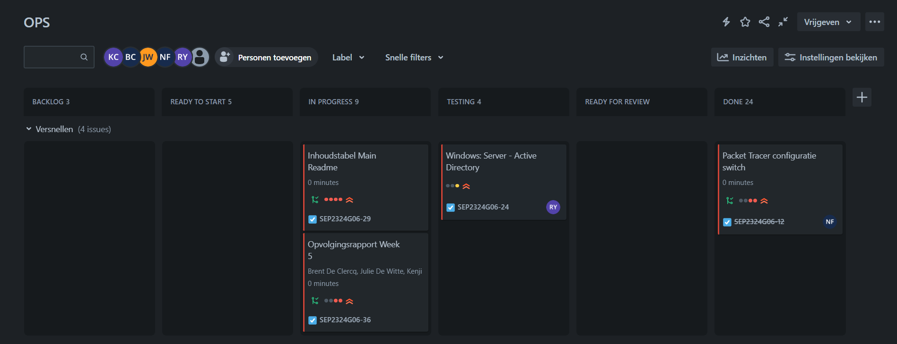
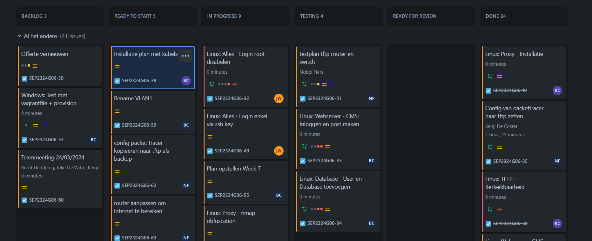
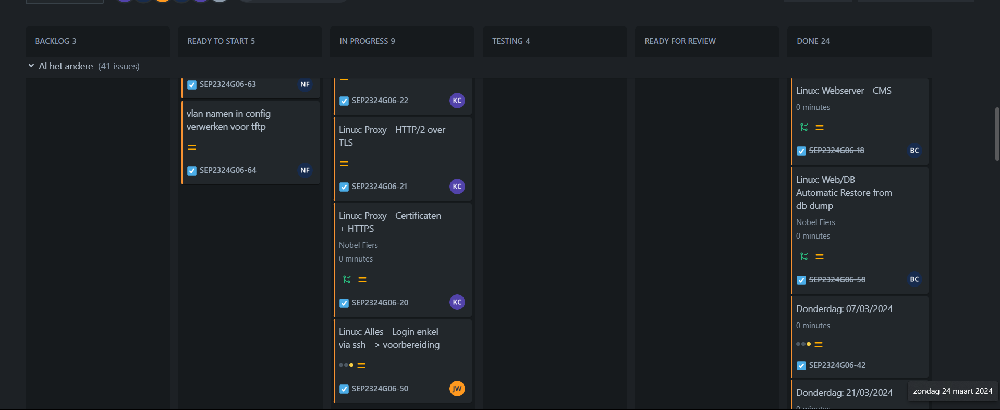
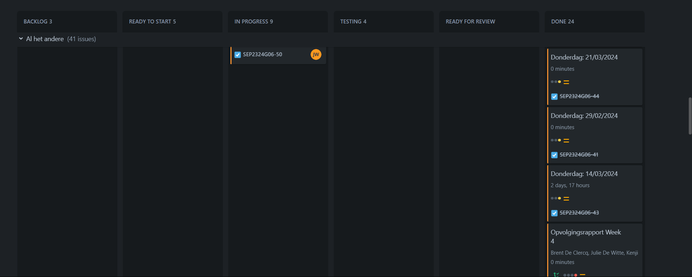
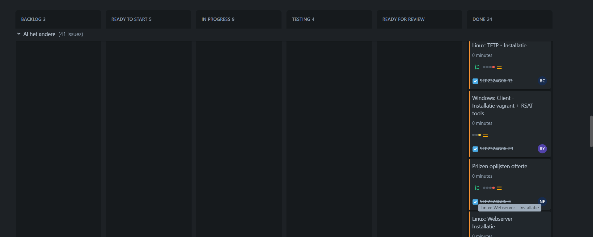
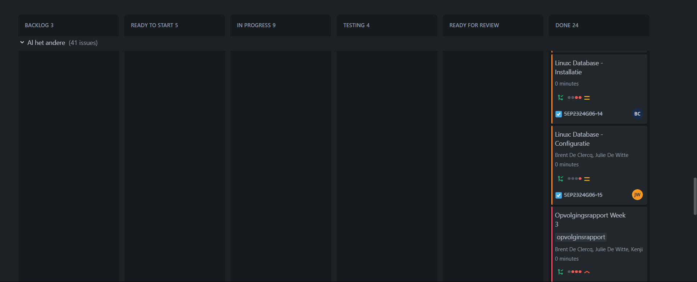
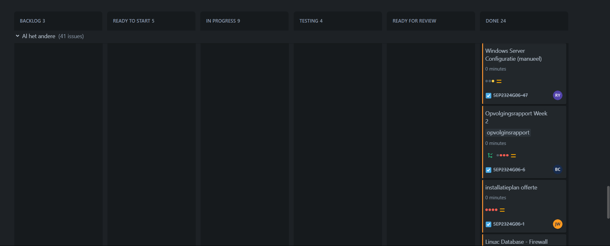
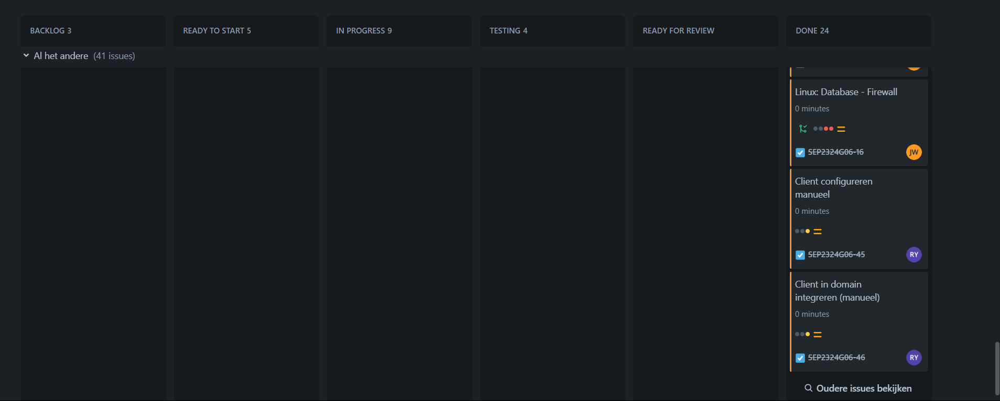

#### Tijdsregistratie

<!-- Voeg hier een screenshot toe van het teamoverzicht van de tijdregistratie, met totaal per student en team -->

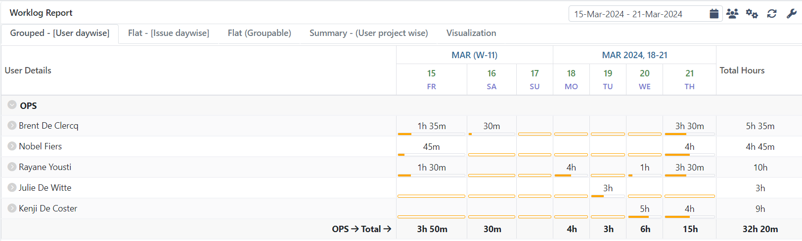

#### Cumulatief flow diagram

<!-- Voeg hier een screenshot toe van het cumulatief flow diagram voor de periode van het rapport. -->

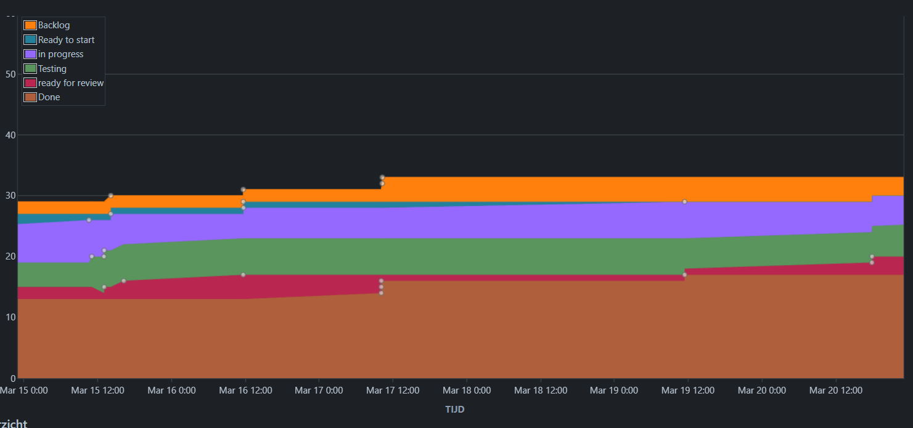

<!-- Voeg hier een screenshot toe van het cumulatief flow diagram voor de volledige periode van het project. -->

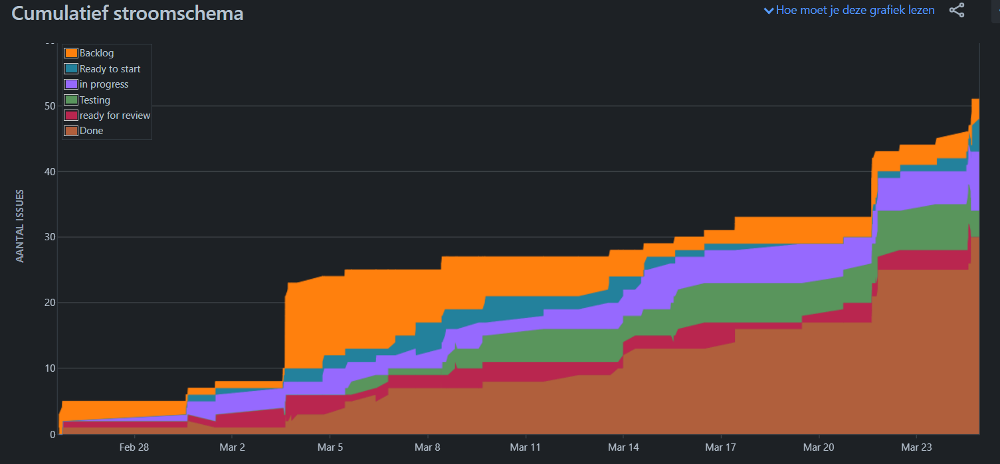

### Brent De Clercq

<!-- Voeg hier een overzicht toe van gerealiseerde taken inclusief links naar relevante commits/documenten. -->

- User en database toegevoegd aan MariaDB
- Ik heb ervoor gezorgd dat de CMS kan communiceren met de database
- Testrapport voor bind-address MariaDB opgesteld

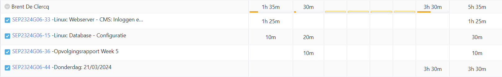

Commits

- [61331f3](https://github.com/HoGentTIN/sep2324-gent-g06/commit/61331f361475edc70b148775c99500acf7038f81)
- [686c517](https://github.com/HoGentTIN/sep2324-gent-g06/commit/686c5178a34c6731b6a0dbb7ab43bb91df009b65)
- [c6ca7fd](https://github.com/HoGentTIN/sep2324-gent-g06/commit/c6ca7fd13f24982c39e371a5f7abea8353345df6)
- [facc916](https://github.com/HoGentTIN/sep2324-gent-g06/commit/facc916f7494378f0129a12a87ba5037a87b9549)

<!-- Voeg hier een screenshot van het individueel tijdregistratierapport, met overzicht van elke taak en bijhorende uren. -->

### Kenji De Coster

<!-- Voeg hier een overzicht toe van gerealiseerde taken inclusief links naar relevante commits/documenten. -->

- ...

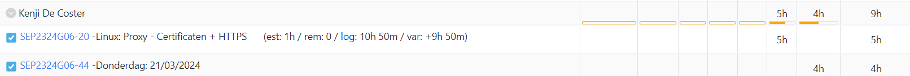

- [eceb427 ](https://github.com/HoGentTIN/sep2324-gent-g06/commit/eceb427e8ffe8fe32142737b32efcf3e230a5ac0)
- [895091a ](https://github.com/HoGentTIN/sep2324-gent-g06/commit/895091a7ab3c3f53aab915d3bf6de2334d2ec42b)
- [6b1317f ](https://github.com/HoGentTIN/sep2324-gent-g06/commit/6b1317f8e2f8a696d25c6bc83f0470dba6291e08)
- [98c1da0 ](https://github.com/HoGentTIN/sep2324-gent-g06/commit/98c1da031e6bb5a6c3b2bef4b652f2e462e6a68d)
- [372bb92 ](https://github.com/HoGentTIN/sep2324-gent-g06/commit/372bb92cc177ded508901884b7507ba77bc09b07)
- [5fca01d ](https://github.com/HoGentTIN/sep2324-gent-g06/commit/5fca01d858e6e8fbd4ec92dfa10b8eeb919760fd)
<!-- Voeg hier een screenshot van het individueel tijdregistratierapport, met overzicht van elke taak en bijhorende uren. -->

### Nobel Fiers

<!-- Voeg hier een overzicht toe van gerealiseerde taken inclusief links naar relevante commits/documenten. -->

- Packet tracer bestanden overgebracht naar de tftp en opgekuist.

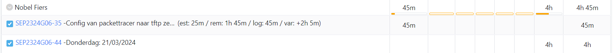

- [fde6c4](https://github.com/HoGentTIN/sep2324-gent-g06/commit/fde6c41136637a66f63285a866692667e08f7d96)

<!-- Voeg hier een screenshot van het individueel tijdregistratierapport, met overzicht van elke taak en bijhorende uren. -->

### Julie De Witte

<!-- Voeg hier een overzicht toe van gerealiseerde taken inclusief links naar relevante commits/documenten. -->

- Geprobeerd root-login via VM's uit te schakelen
- Enkel login op VM's toestaan via SSH-keys

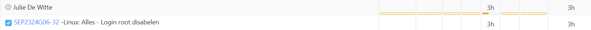

Commits

- [1619ecb](https://github.com/HoGentTIN/sep2324-gent-g06/commit/1619ecb71702df4cb1ddae7095ee6230212cc58e)
- [89d3327](https://github.com/HoGentTIN/sep2324-gent-g06/commit/89d3327657fc178cd46c3c3698c5fa23e52cda43)

<!-- Voeg hier een screenshot van het individueel tijdregistratierapport, met overzicht van elke taak en bijhorende uren. -->

### Rayane Yousti

<!-- Voeg hier een overzicht toe van gerealiseerde taken inclusief links naar relevante commits/documenten. -->
- Users & groups script aangemaakt
- Server manueel nog configureren
- Client manueel configureren
- RSAT-tools installatie
  

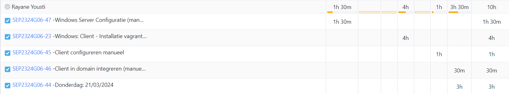

<!-- Voeg hier een screenshot van het individueel tijdregistratierapport, met overzicht van elke taak en bijhorende uren. -->
- [00c386](https://github.com/HoGentTIN/sep2324-gent-g06/commit/00c3865fbebc3e782856f12e12240729693c8007)
- [9341ba](https://github.com/HoGentTIN/sep2324-gent-g06/commit/9341ba2eb5bac98a5b7c516f0fc8591e916882d5)
  
## Wat plan je volgende periode te doen?

### Algemeen

<!-- Voeg hier de doelstellingen toe voor volgende periode. -->

- TFTP werkende krijgen
- Windows verder uitwerken

### Brent De Clercq

<!-- Voeg hier de individuele doelstellingen toe voor volgende periode. -->

- ...

### Kenji De Coster

<!-- Voeg hier de individuele doelstellingen toe voor volgende periode. -->

- ...

### Nobel Fiers

<!-- Voeg hier de individuele doelstellingen toe voor volgende periode. -->

- tftp server bestanden verder uittesten.

### Julie De Witte

<!-- Voeg hier de individuele doelstellingen toe voor volgende periode. -->

- Testrapport opstellen van het laatste deeltje configuratie van de Linux Servers
- Nieuwe taken opnemen op het JIRA bord

### Rayane Yousti

<!-- Voeg hier de individuele doelstellingen toe voor volgende periode. -->
- GPO's nog afmaken
- Shares afwerken
- DHCP te fixen
- DNS forward lookup regelen

## Retrospectieve

### Wat doen jullie goed?

<!-- Voeg hier zaken toe die jullie goed doen naar het proces toe. -->

- ...
- ...

### Waar hebben jullie nog problemen mee?

<!-- Voeg hier zaken toe die volgens jullie beter kunnen naar het proces toe. -->

- ...
- ...

### Feedback

#### Groep

#### Brent De Clercq

#### Kenji De Coster

#### Nobel Fiers

#### Julie De Witte

#### Rayane Yousti
