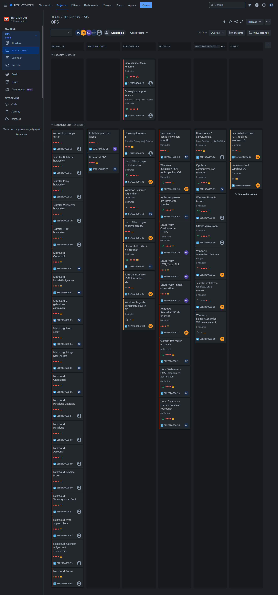
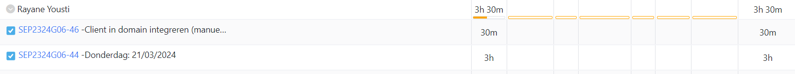

# Opvolgingsrapport 6

## Algemeen

- Groep: G06
- Periode: tot 21/03/2024 tot 27/03/2024
- Datum voortgangsgesprek: 28/03/2024

| Student         | Afw. | Opmerking |
| :-------------- | :--: | :-------- |
| Brent De Clercq |      |           |
| Kenji De Coster |      |           |
| Nobel Fiers     |      |           |
| Julie De Witte  |      |           |
| Rayane Yousti   |      |           |

## Wat heb je deze periode gerealiseerd?

### Algemeen

- ...
- ...

#### KanBan

<!-- Voeg hier een screenshot toe van de huidige toestand van het kanban bord. -->

#### Tijdsregistratie

<!-- Voeg hier een screenshot toe van het teamoverzicht van de tijdregistratie, met totaal per student en team -->

#### Cumulatief flow diagram

<!-- Voeg hier een screenshot toe van het cumulatief flow diagram voor de periode van het rapport. -->

<!-- Voeg hier een screenshot toe van het cumulatief flow diagram voor de volledige periode van het project. -->

### Brent De Clercq

<!-- Voeg hier een overzicht toe van gerealiseerde taken inclusief links naar relevante commits/documenten. -->

- ...

- [d85a01a](https://github.com/HoGentTIN/sep2324-gent-g06/commit/d85a01a9c368cb2d3af0766cfeb1bc692dfee05b)
- [9c079e1](https://github.com/HoGentTIN/sep2324-gent-g06/commit/9c079e1c96cd1a33e3a92e2f9656894abbd078b6)
- [68dc1bb](https://github.com/HoGentTIN/sep2324-gent-g06/commit/68dc1bba25635a038d4fe8e9af348fef3a1e1bdc)
- [7295b6f](https://github.com/HoGentTIN/sep2324-gent-g06/commit/7295b6f3abb826c75dd88652c946bae937cb2463)
- [0f80a54](https://github.com/HoGentTIN/sep2324-gent-g06/commit/0f80a54bf458e7b3cb942eb995156638aa7852bd)
- [02592b2](https://github.com/HoGentTIN/sep2324-gent-g06/commit/02592b2be3412c77b9ba8a85088575dab2b58640)
- [2d68ad0](https://github.com/HoGentTIN/sep2324-gent-g06/commit/2d68ad0b72dc79c14f47af954baba85691c1288b)
- [4749555](https://github.com/HoGentTIN/sep2324-gent-g06/commit/4749555f0abf96acdb0bf93c587651c725511e80)
- [e849e79](https://github.com/HoGentTIN/sep2324-gent-g06/commit/e849e790cb853f4b4816caf7287ceacf8dc5ba8a)
- [78b94e8](https://github.com/HoGentTIN/sep2324-gent-g06/commit/78b94e872838ffb2397bd5https://github.com/HoGentTIN/sep2324-gent-g06/commit/49a829d8b9165c6b99256f37d398892b4e7fa24a52cc571186dde59120)
- 

<!-- Voeg hier een screenshot van het individueel tijdregistratierapport, met overzicht van elke taak en bijhorende uren. -->

### Kenji De Coster

<!-- Voeg hier een overzicht toe van gerealiseerde taken inclusief links naar relevante commits/documenten. -->

- proxy geprutst met https
- proxy nmap obfuscation
- proxy http/2
- packet tracer aangepast

- [49a829d ](https://github.com/HoGentTIN/sep2324-gent-g06/commit/49a829d8b9165c6b99256f37d398892b4e7fa24a)
- [37a28b5 ](https://github.com/HoGentTIN/sep2324-gent-g06/commit/37a28b56808b2b9bee4b8fc939fc7894512044d6)
- [0974816 ](https://github.com/HoGentTIN/sep2324-gent-g06/commit/097481677d4b1e64a3c6ca21b04af273f1fba7ae)
- [71d73fc ](https://github.com/HoGentTIN/sep2324-gent-g06/commit/71d73fc582958f90a48ad82a16fc23123fefc539)
<!-- Voeg hier een screenshot van het individueel tijdregistratierapport, met overzicht van elke taak en bijhorende uren. -->

### Nobel Fiers

<!-- Voeg hier een overzicht toe van gerealiseerde taken inclusief links naar relevante commits/documenten. -->

- problemen met packet tracer proberen oplossen en vermijden
- meegeholpen bij algemene groepsproblemen

  <!-- Voeg hier een screenshot van het individueel tijdregistratierapport, met overzicht van elke taak en bijhorende uren. -->

- geen commit aangezien het meeste oftewel nog op een pc staat of een fysieke opstelling was.

### Julie De Witte

<!-- Voeg hier een overzicht toe van gerealiseerde taken inclusief links naar relevante commits/documenten. -->

- geautomatiseerde powershell-scripts schrijven om windows VM's te installeren
- ps script geschreven om RSAT tools te downloaden
- ps script geschreven om windows server te promoveren tot domeincontroller
- ps script geschreven om organizational units aan te maken binnen active directory

<!-- Voeg hier een screenshot van het individueel tijdregistratierapport, met overzicht van elke taak en bijhorende uren. -->

- [d704c9](https://github.com/HoGentTIN/sep2324-gent-g06/commit/d704c9f44c84054165c2ff6edc85fa2d9421c97d)
- [0032a6](https://github.com/HoGentTIN/sep2324-gent-g06/commit/0032a6e5c7a0f17b25b81e90b7586263cd9f69f4)
- [671cb1](https://github.com/HoGentTIN/sep2324-gent-g06/commit/671cb1e71c83b173b84a32b9cf3323ac7d5c28f1)
- [253ccf](https://github.com/HoGentTIN/sep2324-gent-g06/commit/253ccffd3d56e9e83e989e8812caf3ac526c3c02)
- [ddde9e](https://github.com/HoGentTIN/sep2324-gent-g06/commit/ddde9e4d2e301cf0213f480cecf4f6eaa351e92e)
- [5e74a8](https://github.com/HoGentTIN/sep2324-gent-g06/commit/5e74a8221b7683a90ae4b057e659f14a276d0ba5)
- [e3ed23](https://github.com/HoGentTIN/sep2324-gent-g06/commit/e3ed237ca3289698c3b4650e6dff71090191e0e1)

### Rayane Yousti

<!-- Voeg hier een overzicht toe van gerealiseerde taken inclusief links naar relevante commits/documenten. -->

-IP's nog last minute in orde krijgen
-GPO's manueel
-Shares rechten manueel
-Feeback week 7 noteren

<!-- Voeg hier een screenshot van het individueel tijdregistratierapport, met overzicht van elke taak en bijhorende uren. -->

## Wat plan je volgende periode te doen?

### Algemeen

<!-- Voeg hier de doelstellingen toe voor volgende periode. -->

- Commentaar van vorige evaluatie integreren en offerte samen met netwerkplan ook afwerken

### Brent De Clercq

<!-- Voeg hier de individuele doelstellingen toe voor volgende periode. -->

- Nextcloud

### Kenji De Coster

<!-- Voeg hier de individuele doelstellingen toe voor volgende periode. -->

- CA bekijken om ons certificaat zelf te authenticeren

### Nobel Fiers

<!-- Voeg hier de individuele doelstellingen toe voor volgende periode. -->

- resterende problemen van de opstelling oplossen
- Assisteren bij uitbreidingen

### Julie De Witte

<!-- Voeg hier de individuele doelstellingen toe voor volgende periode. -->

- ...

### Rayane Yousti

<!-- Voeg hier de individuele doelstellingen toe voor volgende periode. -->
- Werken aan de Windows server uitbreidingen
- Julie nog eventueel helpen met automatisatie als het nodig is
- basisopstelling volledig geautomatiseerd hebben staan in orde

- ...

## Retrospectieve

### Wat doen jullie goed?

<!-- Voeg hier zaken toe die jullie goed doen naar het proces toe. -->

- ...
- ...

### Waar hebben jullie nog problemen mee?

<!-- Voeg hier zaken toe die volgens jullie beter kunnen naar het proces toe. -->

- ...
- ...

### Feedback

#### Groep

#### Brent De Clercq

#### Kenji De Coster

#### Nobel Fiers

#### Julie De Witte

#### Rayane Yousti
