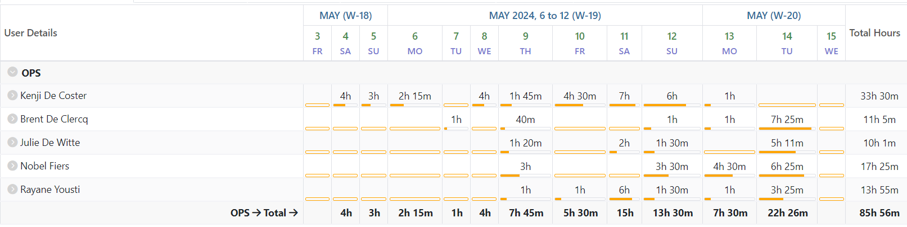
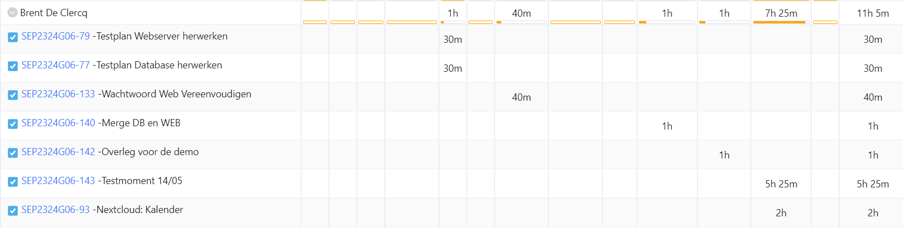
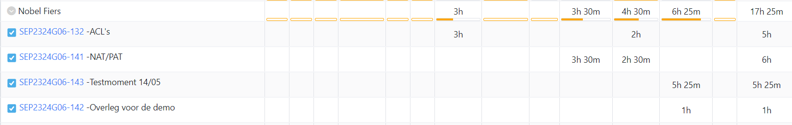

# Opvolgingsrapport 8

## Algemeen

- Groep: G06
- Periode: 03/05/2024 tot 15/05/2024
- Datum voortgangsgesprek: niet van toepassing

| Student         | Afw. | Opmerking |
| :-------------- | :--: | :-------- |
| Brent De Clercq |      |           |
| Kenji De Coster |      |           |
| Nobel Fiers     |      |           |
| Julie De Witte  |      |           |
| Rayane Yousti   |      |           |

## Wat heb je deze periode gerealiseerd?

### Algemeen

- Opstelling SEP opgesteld
- Uitbreidingen afgewerkt

#### KanBan

<!-- Voeg hier een screenshot toe van de huidige toestand van het kanban bord. -->

#### Tijdsregistratie

#### Cumulatief flow diagram

<!-- Voeg hier een screenshot toe van het cumulatief flow diagram voor de periode van het rapport. -->

<!-- Voeg hier een screenshot toe van het cumulatief flow diagram voor de volledige periode van het project. -->

### Brent De Clercq

<!-- Voeg hier een overzicht toe van gerealiseerde taken inclusief links naar relevante commits/documenten. -->

- Nextcloud afgewerkt
  - Kalender Synchronisatie werkt nu
  - Https zou nu ook moeten werken
  - Links kopieren werkt
- Wachtwoord web vereenvoudigd
- web en database samengevoegd bij gebrek aan ip adressen

Commits:

- [0dccbe2](https://github.com/HoGentTIN/sep2324-gent-g06/commit/0dccbe2857d12a3121849879f3f07d19041b6c01)
- [f7da5d2](https://github.com/HoGentTIN/sep2324-gent-g06/commit/f7da5d260f42089225406740315c43eaa7f7c739)
- [b2bb83b](https://github.com/HoGentTIN/sep2324-gent-g06/commit/b2bb83b3a739384d846844fc0369edac6dfa3c2d)
- [30beb94](https://github.com/HoGentTIN/sep2324-gent-g06/commit/30beb9448ba5ec412922da9065bbd68c3ac6690f)
- [4f00e60](https://github.com/HoGentTIN/sep2324-gent-g06/commit/4f00e60b8a7b595cd29c9ac5d25590b96c4aeca8)
- [1ca6da1](https://github.com/HoGentTIN/sep2324-gent-g06/commit/1ca6da1ff8afab2183d46fc94ce32dc34a0273c7)
- [9245e00](https://github.com/HoGentTIN/sep2324-gent-g06/commit/9245e00f6c81952d01fe13a8a9896c30e8aa50b3)
- [a2f131f](https://github.com/HoGentTIN/sep2324-gent-g06/commit/a2f131f1b653e50667b922ed8b32baf43e36c575)
- [e389c6b](https://github.com/HoGentTIN/sep2324-gent-g06/commit/e389c6b787f2ae69a55e2f6eeef241eef1cb2630)
- [6b2cd5d](https://github.com/HoGentTIN/sep2324-gent-g06/commit/6b2cd5daf54f10788e1867a5b815a458b1003126)

<!-- Voeg hier een screenshot van het individueel tijdregistratierapport, met overzicht van elke taak en bijhorende uren. -->

### Kenji De Coster

<!-- Voeg hier een overzicht toe van gerealiseerde taken inclusief links naar relevante commits/documenten. -->

- ...

<!-- Voeg hier een screenshot van het individueel tijdregistratierapport, met overzicht van elke taak en bijhorende uren. -->

### Nobel Fiers

<!-- Voeg hier een overzicht toe van gerealiseerde taken inclusief links naar relevante commits/documenten. -->

- NAT ingesteld op router
- acl's ingesteld op proxy
- foutjes aan configs opgelost

Commits:

- [fb5794](https://github.com/HoGentTIN/sep2324-gent-g06/commit/fb5794b4641be5886a6b54c478557e95a3c36bab)
- [9bc440](https://github.com/HoGentTIN/sep2324-gent-g06/commit/9bc4401356966e614f3f16e77608f8c26b3eaaa1)
- [ec8357](https://github.com/HoGentTIN/sep2324-gent-g06/commit/ec83576ed293e5f8e415bf672d4bfbfc5d993d67)
- [f618a9](https://github.com/HoGentTIN/sep2324-gent-g06/commit/f618a95b56170b200e155366091597cc03688507)

<!-- Voeg hier een screenshot van het individueel tijdregistratierapport, met overzicht van elke taak en bijhorende uren. -->

### Julie De Witte

<!-- Voeg hier een overzicht toe van gerealiseerde taken inclusief links naar relevante commits/documenten. -->

- ...

<!-- Voeg hier een screenshot van het individueel tijdregistratierapport, met overzicht van elke taak en bijhorende uren. -->

### Rayane Yousti

- testrapport opgesteld van windows
- matrix.org server aangemaakt en geconfigureerd + users
- kenji zijn CA deels op client ingesteld
- thunderbird en nextcloud applicatie op client installed

- Commits:

- [3cb0a85](https://github.com/HoGentTIN/sep2324-gent-g06/commit/3cb0a85a9e001cd6d8baf8925709ede38991fb9e)
- [eea4541](https://github.com/HoGentTIN/sep2324-gent-g06/commit/eea4541d9f3d7238b8d351554ec575e5bdcbaa6a)
- [ca4a448](https://github.com/HoGentTIN/sep2324-gent-g06/commit/ca4a448fbaeef855da7140c9aca20cf79fed5088)
- [79a1a8a](https://github.com/HoGentTIN/sep2324-gent-g06/commit/79a1a8ae502e3e6cc9acda559705d604b0faf15f)

<!-- Voeg hier een screenshot van het individueel tijdregistratierapport, met overzicht van elke taak en bijhorende uren. -->

## Wat plan je volgende periode te doen?

Niet van toepassing

### Algemeen

<!-- Voeg hier de doelstellingen toe voor volgende periode. -->

- ...
- ...

### Brent De Clercq

<!-- Voeg hier de individuele doelstellingen toe voor volgende periode. -->

- ...

### Kenji De Coster

<!-- Voeg hier de individuele doelstellingen toe voor volgende periode. -->

- ...

### Nobel Fiers

<!-- Voeg hier de individuele doelstellingen toe voor volgende periode. -->

- niet van toepassing

### Julie De Witte

<!-- Voeg hier de individuele doelstellingen toe voor volgende periode. -->

- ...

### Rayane Yousti

<!-- Voeg hier de individuele doelstellingen toe voor volgende periode. -->

- ...

## Retrospectieve

### Wat doen jullie goed?

<!-- Voeg hier zaken toe die jullie goed doen naar het proces toe. -->

- ...
- ...

### Waar hebben jullie nog problemen mee?

<!-- Voeg hier zaken toe die volgens jullie beter kunnen naar het proces toe. -->

- ...
- ...

### Feedback

#### Groep

#### Brent De Clercq

#### Kenji De Coster

#### Nobel Fiers

#### Julie De Witte

#### Rayane Yousti
