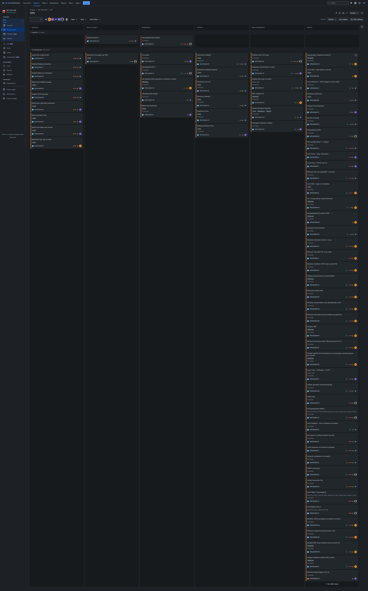
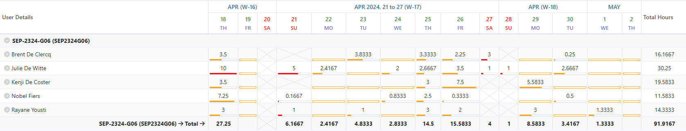
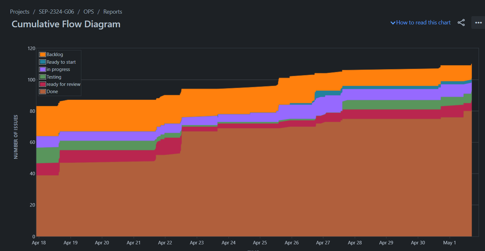
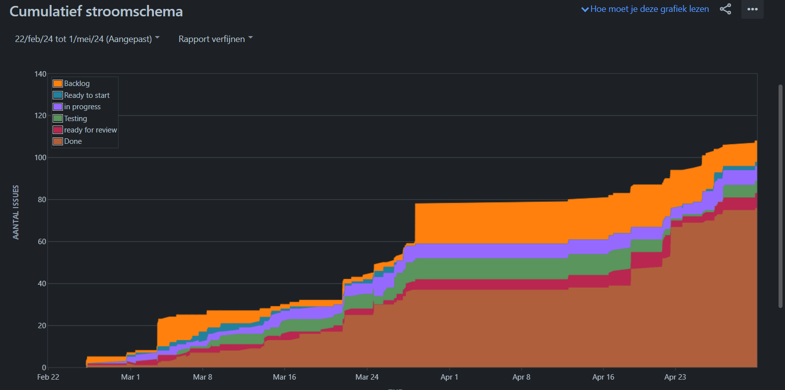
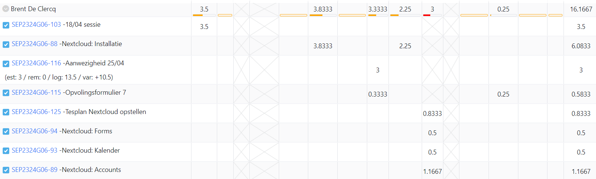
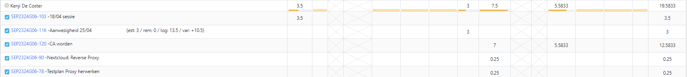
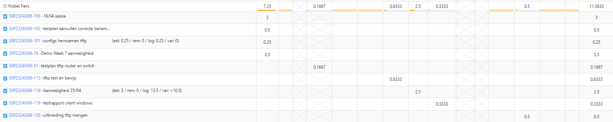
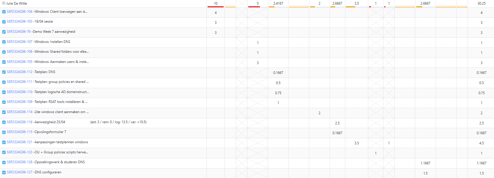
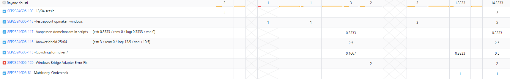

# Opvolgingsrapport 7

## Algemeen

- Groep: G06
- Periode: 18/04/2024 tot 02/05/2024
- Datum voortgangsgesprek: 02/05/2024

| Student         | Afw. | Opmerking |
| :-------------- | :--: | :-------- |
| Brent De Clercq |      |           |
| Kenji De Coster |      |           |
| Nobel Fiers     |      |           |
| Julie De Witte  |      |           |
| Rayane Yousti   |      |           |

## Wat heb je deze periode gerealiseerd?

### Algemeen

- Nextcloud
- Testrapport Windows

#### KanBan

#### Tijdsregistratie

#### Cumulatief flow diagram
<!-- Voeg hier een screenshot toe van het cumulatief flow diagram voor de periode van het rapport. -->

<!-- Voeg hier een screenshot toe van het cumulatief flow diagram voor de volledige periode van het project. -->

### Brent De Clercq

<!-- Voeg hier een overzicht toe van gerealiseerde taken inclusief links naar relevante commits/documenten. -->

- Nextcloud installatie
- Nextcloud gebruikers
- Nextcloud Kalender
- Nextcloud forms

Commits:

- [70f5ef4](https://github.com/HoGentTIN/sep2324-gent-g06/commit/70f5ef4139835757b4eb54895e98c226e1ed2ad4)
- [bc33997](https://github.com/HoGentTIN/sep2324-gent-g06/commit/bc33997267ab15bc4edece69ed4f84b401d95159)
- [83a75aa](https://github.com/HoGentTIN/sep2324-gent-g06/commit/83a75aa6ce3544714d1e0ea92805f77a5fef5ddf)
- [f9a4ed1](https://github.com/HoGentTIN/sep2324-gent-g06/commit/f9a4ed1eb9811fd17c06f90490077a9aa50ef6bf)
- [27265cf](https://github.com/HoGentTIN/sep2324-gent-g06/commit/27265cf590fce4607d9590126329ca34a0238c95)
- [26aa546](https://github.com/HoGentTIN/sep2324-gent-g06/commit/26aa546c000708488392033d6a9d7b367c01bd9e)
- [2e0ffe3](https://github.com/HoGentTIN/sep2324-gent-g06/commit/2e0ffe38eddaca7637e7eb377003c8444563a81b)
- [f139ade](https://github.com/HoGentTIN/sep2324-gent-g06/commit/f139adeb53cf0a641ed0f4e306ba2e30610c406a)
- [22fe657](https://github.com/HoGentTIN/sep2324-gent-g06/commit/22fe6573e8eb888f77eef2c55d62383df500c699)
- [c2df64b](https://github.com/HoGentTIN/sep2324-gent-g06/commit/c2df64b721eff57fe361a389b34252075e8b264a)
- [a88e80d](https://github.com/HoGentTIN/sep2324-gent-g06/commit/a88e80d62187f9efa0f4cf9ad1b4101a015c8bf4)
- [dfd2cca](https://github.com/HoGentTIN/sep2324-gent-g06/commit/dfd2cca82de41fb59ac1298a3716930c7f2163a3)
- [f464535](https://github.com/HoGentTIN/sep2324-gent-g06/commit/f464535f416406474c7a6555c269a1d10e6988da)
- [9720a59](https://github.com/HoGentTIN/sep2324-gent-g06/commit/9720a59a344df055e3437e7aad9f478440ffc12e)
- [5b57d35](https://github.com/HoGentTIN/sep2324-gent-g06/commit/5b57d35db407cbf0135cd434fb7ced61da58fcfb)
- [2f6cac1](https://github.com/HoGentTIN/sep2324-gent-g06/commit/2f6cac12907a6d2e352287795fec25fb3eb53041)
- [656c71d](https://github.com/HoGentTIN/sep2324-gent-g06/commit/656c71d1798535fd5683fd34ebc2be8404480db3)

<!-- Voeg hier een screenshot van het individueel tijdregistratierapport, met overzicht van elke taak en bijhorende uren. -->

### Kenji De Coster

<!-- Voeg hier een overzicht toe van gerealiseerde taken inclusief links naar relevante commits/documenten. -->

- Nextcloud geïntegreerd in de reverse proxy (nog te testen)
- Bezig geweest met een CA te worden/ aan te maken

commits:
- [059794c](https://github.com/HoGentTIN/sep2324-gent-g06/commit/059794c11ae60af2339bd86c59b1cd7c1d145e8d)
- [47c5a0d](https://github.com/HoGentTIN/sep2324-gent-g06/commit/47c5a0dd3b3f2942dd309f5bf96f881962e61c63)
- [9b644ed](https://github.com/HoGentTIN/sep2324-gent-g06/commit/9b644ed4442d210b8fc7e1057d1d9991ba30f45a)
- [cfb0f25](https://github.com/HoGentTIN/sep2324-gent-g06/commit/cfb0f253af63306a76be54ff7a5d761fb0a82883)
- [861ff38](https://github.com/HoGentTIN/sep2324-gent-g06/commit/861ff3801228af1ca3b372f6b667eddf6597792c)
- [3a7c56d](https://github.com/HoGentTIN/sep2324-gent-g06/commit/3a7c56d1631bb18cd382a5d4017513f3b2bc77a0)
- [73a5278](https://github.com/HoGentTIN/sep2324-gent-g06/commit/73a527894e230827c6c6344bca3e67e2f2fb6f26)
- [f0e143a](https://github.com/HoGentTIN/sep2324-gent-g06/commit/f0e143a668bb069c849068b3ada3a62ebbb07386)
- [fbf31ea](https://github.com/HoGentTIN/sep2324-gent-g06/commit/fbf31eaf676970dcc06c622537b4c338cf849409)
- [507ea98](https://github.com/HoGentTIN/sep2324-gent-g06/commit/507ea9861ae141bbb0f5de47e9c089b37b5ce1bf)
- [ed13c93](https://github.com/HoGentTIN/sep2324-gent-g06/commit/ed13c936b151ecc6e575bf4f0fc03b2a08f56d5a)
- [2039ba3](https://github.com/HoGentTIN/sep2324-gent-g06/commit/2039ba317995854c36526b8171dfd1074dd64d4f)
- [c251336](https://github.com/HoGentTIN/sep2324-gent-g06/commit/c25133640ad5ba4e12ceb7c58a63285d13077b2d)
- [89e9003](https://github.com/HoGentTIN/sep2324-gent-g06/commit/89e9003f123267ce29c34c42de0612eeb8bab84f)
- [6fa846c](https://github.com/HoGentTIN/sep2324-gent-g06/commit/6fa846c1d6e7be4a262719b03ee07bd619de4c61)
- [4fe1bc2](https://github.com/HoGentTIN/sep2324-gent-g06/commit/4fe1bc2fe50ebbf9327dfca91f490ef67770790b)

### Nobel Fiers

<!-- Voeg hier een overzicht toe van gerealiseerde taken inclusief links naar relevante commits/documenten. -->

- testplannen tftp aangepast met juiste benaming bestanden en afbeeldingen van uitvoer.

Commits:

- [625401](https://github.com/HoGentTIN/sep2324-gent-g06/commit/625401420753e36dab8f90e08f703e85c0a90b52)
- [c6fe1b](https://github.com/HoGentTIN/sep2324-gent-g06/commit/c6fe1be4a1b8c3253482e4455afaf9bbcb5cc545)
- [c8abdc](https://github.com/HoGentTIN/sep2324-gent-g06/commit/c8abdc48eb40baaa127453c65c4d7a13678ded9f)
- [075286](https://github.com/HoGentTIN/sep2324-gent-g06/commit/075286ae5a47a58fb3e5912ee75c346fb918c266)

### Julie De Witte

<!-- Voeg hier een overzicht toe van gerealiseerde taken inclusief links naar relevante commits/documenten. -->

- Laatste aanpassingen aan automatisatie van gehele Windows omgeving
- Testplannen geschreven van alles van Windows
- Dns opnieuw geconfigureerd want daar zaten nog enkele fouten in

Commits:

- [0eb7436](https://github.com/HoGentTIN/sep2324-gent-g06/commit/0eb7436fb694e321d6ce25542cf7032352403c02)
- [14ff23e](https://github.com/HoGentTIN/sep2324-gent-g06/commit/14ff23e34e6058179da6b24171904701047d89bf)
- [2792381](https://github.com/HoGentTIN/sep2324-gent-g06/commit/27923810c07b1a0933e8d5a7903cbc84fc11c05a)
- [82269a7](https://github.com/HoGentTIN/sep2324-gent-g06/commit/82269a7406f79de3edd9e9c61116eca38ca3140b)
- [b83679b](https://github.com/HoGentTIN/sep2324-gent-g06/commit/b83679b41a95fe1f27b02d0b87455d07c0cc337a)
- [f13d813](https://github.com/HoGentTIN/sep2324-gent-g06/commit/f13d8135b4741a90545126877344b7c2f958bd5b)
- [b7b9fea](https://github.com/HoGentTIN/sep2324-gent-g06/commit/b7b9feaef650c902ea0635144d90c6e8fb0791f6)
- [03337fe](https://github.com/HoGentTIN/sep2324-gent-g06/commit/03337fe989cb2b77d75b581a67aaeef3b1544b52)
- [4708fb3](https://github.com/HoGentTIN/sep2324-gent-g06/commit/4708fb3eedf1f2a6df520ebb8aa595faa14fc1f0)
- [ee74ceb](https://github.com/HoGentTIN/sep2324-gent-g06/commit/ee74ceb74ee4fbf727d2f200be62760a2889391f)
- [d968549](https://github.com/HoGentTIN/sep2324-gent-g06/commit/d968549b4dee6bb8fc64676c1ef89b25fae2454d)
- [f668db9](https://github.com/HoGentTIN/sep2324-gent-g06/commit/f668db9422bb686ad8ea12bab79ce710d4704c13)
- [e38168f](https://github.com/HoGentTIN/sep2324-gent-g06/commit/e38168fde137d0239e8e8d4836cf1bfd283a280b)
- [e88cc55](https://github.com/HoGentTIN/sep2324-gent-g06/commit/e88cc55dfb62fe90d3df896d66c5b288825c880e)

### Rayane Yousti

<!-- Voeg hier een overzicht toe van gerealiseerde taken inclusief links naar relevante commits/documenten. -->

- Domeinnaam in scripts aangepast
- VirtualBox problemen opgelost
- Windows Server testrapport opgemaakt
- Onderzoek uitbreiding Matrix.org

Commits:

- [8fbe5cc](https://github.com/HoGentTIN/sep2324-gent-g06/commit/8fbe5cc20d01a834f48587e52bf44d48bf949108)
- [e4f1f7a](https://github.com/HoGentTIN/sep2324-gent-g06/commit/e4f1f7aa8f195aaec7463dcd62fe45a8e6c8dfc4)
- [7c88593](https://github.com/HoGentTIN/sep2324-gent-g06/commit/7c88593a7dccf4cd3638b6aaa9ddee94ccbed1bc)
- [0122ea9](https://github.com/HoGentTIN/sep2324-gent-g06/commit/0122ea924f2f74b09926031ae7b798afe5b659b8)

## Wat plan je volgende periode te doen?

### Algemeen

<!-- Voeg hier de doelstellingen toe voor volgende periode. -->

- Matrix.org volledig opmaken + testplan opstellen
- ...

### Brent De Clercq

<!-- Voeg hier de individuele doelstellingen toe voor volgende periode. -->

- Nog eens kijken naar andere uitbreidingen
- Hele setup leren, zodat ik op de eind demo weet hoe alles in elkaar zit

### Kenji De Coster

<!-- Voeg hier de individuele doelstellingen toe voor volgende periode. -->

- CA uitbreiding afwerken

### Nobel Fiers

<!-- Voeg hier de individuele doelstellingen toe voor volgende periode. -->

- Uitbreidingen indien nodig en mogelijks overgebleven kaarten afwerken

### Julie De Witte

<!-- Voeg hier de individuele doelstellingen toe voor volgende periode. -->

- Redundante windows server opstellen (uitbreiding)
- Gehele setup testen van Windows

### Rayane Yousti

<!-- Voeg hier de individuele doelstellingen toe voor volgende periode. -->

- Uitbreiding Matrix.org volledig afmaken tegen volgende meeting
- Testrapport opstellen van uittbreiding

## Retrospectieve

### Wat doen jullie goed?

<!-- Voeg hier zaken toe die jullie goed doen naar het proces toe. -->

- ...
- ...

### Waar hebben jullie nog problemen mee?

<!-- Voeg hier zaken toe die volgens jullie beter kunnen naar het proces toe. -->

- ...
- ...

### Feedback

#### Groep

#### Brent De Clercq

#### Kenji De Coster

#### Nobel Fiers

#### Julie De Witte

#### Rayane Yousti
