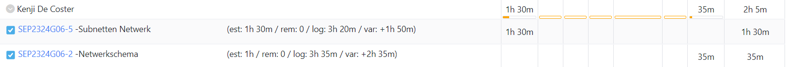

# Opvolgingsrapport 2

## Algemeen

- Groep: G06
- Periode: 22/02/2024 tot 29/02/2024
- Datum voortgangsgesprek: 29/02/2024

| Student         | Afw. | Opmerking |
| :-------------- | :--: | :-------- |
| Brent De Clercq |      |           |
| Kenji De Coster |      |           |
| Nobel Fiers     |      |           |
| Julie De Witte  |      |           |
| Rayane Yousti   |      |           |

## Wat heb je deze periode gerealiseerd?

### Algemeen

- Subnetten Netwerk
- Begin Installatieplan en offerte

#### KanBan

#### Tijdsregistratie

#### Cumulatief flow diagram

Cumulative Flow Diagram (periode, is deze week hetzelfde als volledig project)

### Brent De Clercq

<!-- Voeg hier een overzicht toe van gerealiseerde taken inclusief links naar relevante commits/documenten. -->

Commits:

- [3ca9cb](https://github.com/HoGentTIN/sep2324-gent-g06/commit/3ca9cbebfca830c4ee6fb1d80fb2651a84bd45af)
- [cd6944](https://github.com/HoGentTIN/sep2324-gent-g06/commit/cd6944a933f30a24711f4d2ac4ab763144136ef5)

- Ik heb mij bezig gehouden met het subnetten van het netwerk

### Kenji De Coster

<!-- Voeg hier een overzicht toe van gerealiseerde taken inclusief links naar relevante commits/documenten. -->

- Geholpen met subnetten

### Nobel Fiers

<!-- Voeg hier een overzicht toe van gerealiseerde taken inclusief links naar relevante commits/documenten. -->

- Start prijzen opzoeken voor offerte

### Julie De Witte

<!-- Voeg hier een overzicht toe van gerealiseerde taken inclusief links naar relevante commits/documenten. -->

- Installatieplan

### Rayane Yousti

<!-- Voeg hier een overzicht toe van gerealiseerde taken inclusief links naar relevante commits/documenten. -->

- Momenteel nog niks

## Wat plan je volgende periode te doen?

### Algemeen

<!-- Voeg hier de doelstellingen toe voor volgende periode. -->

- Offerte
- Installatieplan

### Brent De Clercq

<!-- Voeg hier de individuele doelstellingen toe voor volgende periode. -->

- Misschien de subnetten nog eens bekijken

### Kenji De Coster

<!-- Voeg hier de individuele doelstellingen toe voor volgende periode. -->

- ...

### Nobel Fiers

<!-- Voeg hier de individuele doelstellingen toe voor volgende periode. -->

- Kostprijsberekening

### Julie De Witte

<!-- Voeg hier de individuele doelstellingen toe voor volgende periode. -->

- ...

### Rayane Yousti

<!-- Voeg hier de individuele doelstellingen toe voor volgende periode. -->

- ...

## Retrospectieve

### Wat doen jullie goed?

<!-- Voeg hier zaken toe die jullie goed doen naar het proces toe. -->

- ...
- ...

### Waar hebben jullie nog problemen mee?

<!-- Voeg hier zaken toe die volgens jullie beter kunnen naar het proces toe. -->

- ...
- ...

### Feedback

#### Groep

#### Brent De Clercq

#### Kenji De Coster

#### Nobel Fiers

#### Julie De Witte

#### Rayane Yousti
