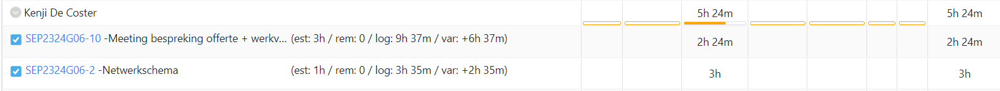

# Opvolgingsrapport 3

## Algemeen

- Groep: G06
- Periode: 29/02/2024 tot 06/03/2024
- Datum voortgangsgesprek: 07/03/2024

| Student         | Afw. | Opmerking |
| :-------------- | :--: | :-------- |
| Brent De Clercq |      |           |
| Kenji De Coster |      |           |
| Nobel Fiers     |      |           |
| Julie De Witte  |      |           |
| Rayane Yousti   |      |           |

## Wat heb je deze periode gerealiseerd?

### Algemeen

- ...
- ...

#### KanBan

<!-- Voeg hier een screenshot toe van de huidige toestand van het kanban bord. -->

#### Tijdsregistratie

<!-- Voeg hier een screenshot toe van het teamoverzicht van de tijdregistratie, met totaal per student en team -->

#### Cumulatief flow diagram

<!-- Voeg hier een screenshot toe van het cumulatief flow diagram voor de periode van het rapport. -->

<!-- Voeg hier een screenshot toe van het cumulatief flow diagram voor de volledige periode van het project. -->

### Brent De Clercq

<!-- Voeg hier een overzicht toe van gerealiseerde taken inclusief links naar relevante commits/documenten. -->

- Subnetten herbekeken
- Aanpassen van subnet DMZ van /30 naar /29
- Updaten IP-adressen tabel
- Start installatie van TFTP

Commits:

- [edf8b4](https://github.com/HoGentTIN/sep2324-gent-g06/commit/edf8b48756a76fc9b2f2668b08b52fee35067ec6)
- [0f39192](https://github.com/HoGentTIN/sep2324-gent-g06/commit/0f39192877b528878eb7f549e571b73d7977edaa)
- [e47c932](https://github.com/HoGentTIN/sep2324-gent-g06/commit/e47c93239810a14e743298712396477f94add0b5)
- [ba19aa5](https://github.com/HoGentTIN/sep2324-gent-g06/commit/ba19aa515afb36e059f6eab5e8b47fb5f1f02772)
- [9cf5392](https://github.com/HoGentTIN/sep2324-gent-g06/commit/9cf5392b22f3497abdda3d1cd0b9c3d7a16f2c7c)

<!-- Voeg hier een screenshot van het individueel tijdregistratierapport, met overzicht van elke taak en bijhorende uren. -->

### Kenji De Coster

<!-- Voeg hier een overzicht toe van gerealiseerde taken inclusief links naar relevante commits/documenten. -->

- IP-adressen tabel een klein beetje aangepast
- netwerkschema van onze offerte opgesteld + het netwerkschema voor de packet tracer wat aangepast

<!-- Voeg hier een screenshot van het individueel tijdregistratierapport, met overzicht van elke taak en bijhorende uren. -->

Commits:

- [ecf907a](https://github.com/HoGentTIN/sep2324-gent-g06/commit/ecf907a522342d075f578eefd406f7181be2c930)

- [14f6a21](https://github.com/HoGentTIN/sep2324-gent-g06/commit/14f6a21a67056a7dd5b048ac25e67d6c28184de2)

- [4c7ee8b](https://github.com/HoGentTIN/sep2324-gent-g06/commit/4c7ee8bcbbe4b2d30043e787ad06453e6722993e)

- [c353913](https://github.com/HoGentTIN/sep2324-gent-g06/commit/c3539138b367947c5f593033517a3ebb21e08b0c)

- [827d272](https://github.com/HoGentTIN/sep2324-gent-g06/commit/827d272043b61894e967cead494448e1d364ba5c)

- [1a2bdc0](https://github.com/HoGentTIN/sep2324-gent-g06/commit/1a2bdc0aba7cf3538015c993842e64c5a1e39fb5)

- [94b2d0e](https://github.com/HoGentTIN/sep2324-gent-g06/commit/94b2d0e350ef12d72317c45efa7a3e60bfc8b4ef)

### Nobel Fiers

<!-- Voeg hier een overzicht toe van gerealiseerde taken inclusief links naar relevante commits/documenten. -->

- ...

<!-- Voeg hier een screenshot van het individueel tijdregistratierapport, met overzicht van elke taak en bijhorende uren. -->

### Julie De Witte

<!-- Voeg hier een overzicht toe van gerealiseerde taken inclusief links naar relevante commits/documenten. -->

- Installatieplan uitgewerkt in detail via ConceptDraw
- Versie van server rack uitgewerkt

Commits:

- [e09836c](https://github.com/HoGentTIN/sep2324-gent-g06/commit/e09836c5183370a6da00785d45c7899f9b558132)
- [620e826](https://github.com/HoGentTIN/sep2324-gent-g06/commit/620e826f4f8fd13ed66d65c5dded58828d15c91e)

<!-- Voeg hier een screenshot van het individueel tijdregistratierapport, met overzicht van elke taak en bijhorende uren. -->

### Rayane Yousti

<!-- Voeg hier een overzicht toe van gerealiseerde taken inclusief links naar relevante commits/documenten. -->

- ...

<!-- Voeg hier een screenshot van het individueel tijdregistratierapport, met overzicht van elke taak en bijhorende uren. -->

## Wat plan je volgende periode te doen?

### Algemeen

<!-- Voeg hier de doelstellingen toe voor volgende periode. -->

- Beginnen aan de basis opstelling
- ...

### Brent De Clercq

<!-- Voeg hier de individuele doelstellingen toe voor volgende periode. -->

- Starten met de installatie van Linux Database

### Kenji De Coster

<!-- Voeg hier de individuele doelstellingen toe voor volgende periode. -->

- Vermoedelijk een deel van de linux server configureren

### Nobel Fiers

<!-- Voeg hier de individuele doelstellingen toe voor volgende periode. -->

- ...

### Julie De Witte

<!-- Voeg hier de individuele doelstellingen toe voor volgende periode. -->

- Linux database configureren
- Linux database firewall configureren

### Rayane Yousti

<!-- Voeg hier de individuele doelstellingen toe voor volgende periode. -->

- ...

## Retrospectieve

### Wat doen jullie goed?

<!-- Voeg hier zaken toe die jullie goed doen naar het proces toe. -->

- Taken bij maken
- Taken verdelen
-
- ...

### Waar hebben jullie nog problemen mee?

<!-- Voeg hier zaken toe die volgens jullie beter kunnen naar het proces toe. -->

- Het opvolginsgrapport invullen
- Een logboek bijhouden
- ...

### Feedback

#### Groep

#### Brent De Clercq

#### Kenji De Coster

#### Nobel Fiers

#### Julie De Witte

#### Rayane Yousti
