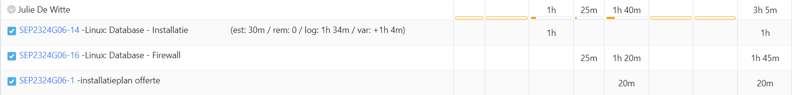

# Opvolgingsrapport 4

## Algemeen

- Groep: G06
- Periode: 07/03/2024 tot 13/03/2024
- Datum voortgangsgesprek: 14/03/2024

| Student         | Afw. | Opmerking |
| :-------------- | :--: | :-------- |
| Brent De Clercq |      |           |
| Kenji De Coster |      |           |
| Nobel Fiers     |      |           |
| Julie De Witte  |      |           |
| Rayane Yousti   |      |           |

## Wat heb je deze periode gerealiseerd?

### Algemeen

- ...
- ...

#### KanBan

<!-- Voeg hier een screenshot toe van de huidige toestand van het kanban bord. -->

#### Tijdsregistratie

<!-- Voeg hier een screenshot toe van het teamoverzicht van de tijdregistratie, met totaal per student en team -->

#### Cumulatief flow diagram

<!-- Voeg hier een screenshot toe van het cumulatief flow diagram voor de periode van het rapport. -->

<!-- Voeg hier een screenshot toe van het cumulatief flow diagram voor de volledige periode van het project. -->

### Brent De Clercq

<!-- Voeg hier een overzicht toe van gerealiseerde taken inclusief links naar relevante commits/documenten. -->

- Installatie MariaDB op de database server
- Installatie HTTP/Apache op de webserver
- Installatie en configuratie van CMS: Wordpress

Commits:

- [9d1bb54](https://github.com/HoGentTIN/sep2324-gent-g06/commit/9d1bb5483e52ce69117b9d99b9f780f19871b8e7)
- [9b0399](https://github.com/HoGentTIN/sep2324-gent-g06/commit/9b039910c033ef4c5ba8710f61cd6ba53aaef37e)
- [9939de](https://github.com/HoGentTIN/sep2324-gent-g06/commit/9939def32cb12d2ed1ccd7ee27248fa565ca6e45)
- [fd8e348](https://github.com/HoGentTIN/sep2324-gent-g06/commit/fd8e34845e4c849dc8da0e037d01db4e96276ec5)
- [2dc6f30](https://github.com/HoGentTIN/sep2324-gent-g06/commit/2dc6f3069e9c1ebff158d6cae1a1fa94455e5a4a)
- [315ab1d](https://github.com/HoGentTIN/sep2324-gent-g06/commit/315ab1dc29a557f953b8881f4f506c470fb6a8dc)
- [f87ef54] (https://github.com/HoGentTIN/sep2324-gent-g06/commit/f87ef54fabcbfa615870e154d4282ce6465c195e)
- [8bfc773] (https://github.com/HoGentTIN/sep2324-gent-g06/commit/8bfc773cf69b84eec9d9056284348a9ee559e03d)
- [621a430] (https://github.com/HoGentTIN/sep2324-gent-g06/commit/621a4301b67351e8df036e165d0270ddd2bf0dff)
- [1390529] (https://github.com/HoGentTIN/sep2324-gent-g06/commit/13905292357c78c0ffea8fcac64f1c44254c0e76)
- [fe9002d] (https://github.com/HoGentTIN/sep2324-gent-g06/commit/fe9002dccf5343304a077737388fb228b3fb6873)
- [be47388] (https://github.com/HoGentTIN/sep2324-gent-g06/commit/be473885c14f4bba42659ca92d3b607a98b2b111)
- [271dd8e] (https://github.com/HoGentTIN/sep2324-gent-g06/commit/271dd8e1360fe7b08c1015cab4f02b71c70b6068)
- [6dd6742] (https://github.com/HoGentTIN/sep2324-gent-g06/commit/6dd674214f1748c0cf8bb5b83f128401eb58b5f4)
- [3fb0a04] (https://github.com/HoGentTIN/sep2324-gent-g06/commit/3fb0a048d9155eb0ed4310649af5169451cef7ae)
- [606ee0c] (https://github.com/HoGentTIN/sep2324-gent-g06/commit/606ee0cb37d563066b91eb8d1d97dead99cc0f52)

<!-- Voeg hier een screenshot van het individueel tijdregistratierapport, met overzicht van elke taak en bijhorende uren. -->

### Kenji De Coster

<!-- Voeg hier een overzicht toe van gerealiseerde taken inclusief links naar relevante commits/documenten. -->

- ...

Commits:

- [b3914a5] (https://github.com/HoGentTIN/sep2324-gent-g06/commit/b3914a5f4857430ba7624ef689ffbc5a92ba1d13)
- [d2ba32c] (https://github.com/HoGentTIN/sep2324-gent-g06/commit/d2ba32c5314f291ee16b81355cc7dcdd3a1552df)
- [cb9f586] (https://github.com/HoGentTIN/sep2324-gent-g06/commit/cb9f586f1f78537a70caec7642fa8e71a3caf71d)
- [6f877ce] (https://github.com/HoGentTIN/sep2324-gent-g06/commit/6f877cec87d7c6b5f4f0b868f9c0884a6678d7f7)
- [9be51db] (https://github.com/HoGentTIN/sep2324-gent-g06/commit/9be51db128b6f58d5cdfbe63775587d5b48f04c5)
- [2220cfd] (https://github.com/HoGentTIN/sep2324-gent-g06/commit/2220cfd9179402d8c1e0aa470d806ab46682891c)
- [1ee5de7] (https://github.com/HoGentTIN/sep2324-gent-g06/commit/1ee5de737e49c2cddda74f8117e511145ec4e231)

<!-- Voeg hier een screenshot van het individueel tijdregistratierapport, met overzicht van elke taak en bijhorende uren. -->

### Nobel Fiers

<!-- Voeg hier een overzicht toe van gerealiseerde taken inclusief links naar relevante commits/documenten. -->

- configureren switch packet tracer en pingen getest.
  
  Commits:

- [97fc8bf](https://github.com/HoGentTIN/sep2324-gent-g06/pull/35/commits/97fc8bf6fdf881a577fc0f0f97e6eca5d0f1ccb9)

<!-- Voeg hier een screenshot van het individueel tijdregistratierapport, met overzicht van elke taak en bijhorende uren. -->

### Julie De Witte

<!-- Voeg hier een overzicht toe van gerealiseerde taken inclusief links naar relevante commits/documenten. -->

- ...

<!-- Voeg hier een screenshot van het individueel tijdregistratierapport, met overzicht van elke taak en bijhorende uren. -->

### Rayane Yousti

<!-- Voeg hier een overzicht toe van gerealiseerde taken inclusief links naar relevante commits/documenten. -->

- ...

<!-- Voeg hier een screenshot van het individueel tijdregistratierapport, met overzicht van elke taak en bijhorende uren. -->

## Wat plan je volgende periode te doen?

### Algemeen

<!-- Voeg hier de doelstellingen toe voor volgende periode. -->

- ...
- ...

### Brent De Clercq

<!-- Voeg hier de individuele doelstellingen toe voor volgende periode. -->

- ...

### Kenji De Coster

<!-- Voeg hier de individuele doelstellingen toe voor volgende periode. -->

- Proxy server afwerken
- installatie plan en offerte aanpassen aan de gegeven commentaar

### Nobel Fiers

<!-- Voeg hier de individuele doelstellingen toe voor volgende periode. -->

- Proberen de windows server to configureren indien deze nog niet geconfigureerd is en mogelijks ook shared folders opstellen.

### Julie De Witte

<!-- Voeg hier de individuele doelstellingen toe voor volgende periode. -->

- ...

### Rayane Yousti

<!-- Voeg hier de individuele doelstellingen toe voor volgende periode. -->

- ...

## Retrospectieve

### Wat doen jullie goed?

<!-- Voeg hier zaken toe die jullie goed doen naar het proces toe. -->

- ...
- ...

### Waar hebben jullie nog problemen mee?

<!-- Voeg hier zaken toe die volgens jullie beter kunnen naar het proces toe. -->

- ...
- ...

### Feedback

#### Groep

#### Brent De Clercq

#### Kenji De Coster

#### Nobel Fiers

#### Julie De Witte

#### Rayane Yousti
